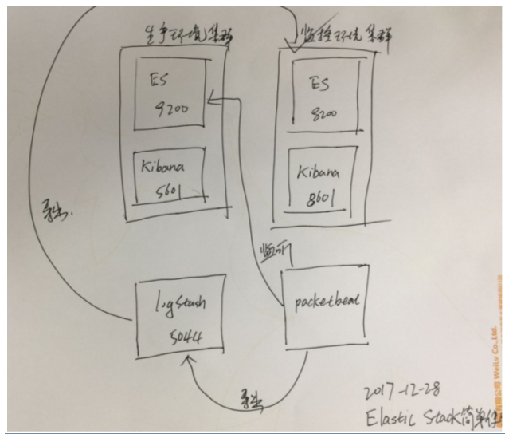

# 案例

# 集群监控ElasticSearch实战

## 拓扑图




# 配置

## 大致的配置流程

```
   Production Cluster #生产环境 存储集群
         Elasticsearch http://127.0.0.1:9200
         Kibana http://127.0.0.1:5601
 
    Monitoring Cluster  #监控集群
         Elasticsearch http://127.0.0.1:8200
             bin/elasticsearch -Ecluster.name=sniff_search -Ehttp.port=8200 -Epath.data=sniff
 
         Kibana http://127.0.0.1:8601
             bin/kibana -e http://127.0.0.1:8200 -p 8601  #监听端口8200
    
    logStash  #端口5044  #导出端口8200
         bin/logstash -f sniff_search.conf
 
    packetbeat  #监听端口9200  导出端口(logStash) 5044
         sudo ./packetbeat -c -c sniff_search.yml -strict.perms=false
         
 
 
    Production与Monitoring 不能是一个集群,否则会进入抓包死循环
 
```


## logstash

```
#部分配置代码
 
input {
    beats {
        port => 5044
    }
}
filter {
    if "search" in [request]{
        grok {
            match => { "request" => ".*\n\{(?<query_body>.*)"}
        }
        grok {
            match => { "path" => "\/(?<index>.*)\/_search"}
        }
     if [index] {
      } else {
            mutate {
              add_field  => { "index" => "All" }
        }
      }
 
      mutate {
              update  => { "query_body" => "{%{query_body}"}}
      }
 
  #    mutate {
  #        remove_field => [ "[http][response][body]" ]
  #    }
}
 
output {
  stdout{codec=>rubydebug}
 
  if "search" in [request]{
        elasticsearch {
        hosts => "192.168.10.55:8200"
        }
   }
}


```