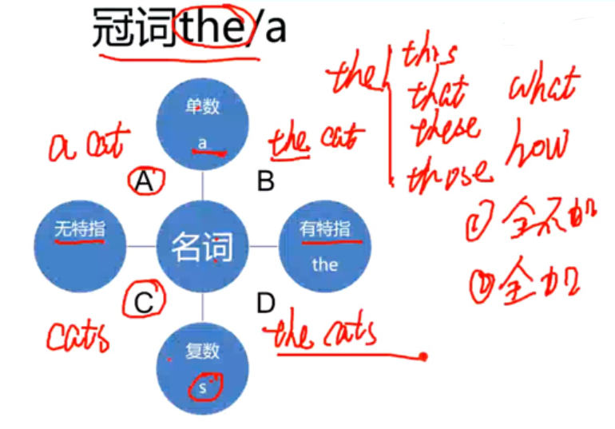

# en

## 常用
- 冠词 a the 区分

	- 单数 a,复制加s	[如果没有说要多少个/只,则使用复数s]
		- I want **a** cat.  #我要一只猫
		- I want cats.	#我想要猫
	- 有特指用the,表示这个/那个/这些/那些	[this that these those]
		- I want **the** cat. #我想要这只猫
- to for区分
	- to 中文意思 "针对" "对" 对某人 
		- listen **to** me [听我说]
	- for 中文意思 "为"
		- I bought a ticket **for** him. 我为他买票
- over under区分  [在上面/下面跨越]
	- The plane flew **over** my head.  #飞机在我头部飞过
	- The river flows **under** the bridge.	#河水在桥底流过
	- The boy is runing **under** the tree.	#男孩从树下跑过
- above below区分 [处于半旋屏状态垂直的上方/下方  或者是静态]
	- The boy is  sit **below** the tree.	#一个男孩坐在树下
	- The helicopter is **above** me. #直升飞机在我的上方[直升飞机是垂直于上方的]

## fn

词性的简写|&nbsp;|&nbsp;|&nbsp;|&nbsp;
----|---|----- |----- |-----
名词|Noun|n.|Boy|Water
动词|Verb|v.|Raise|Rise
形容词|Adjective|adj.|Beautiful|Fine
副词|Adverb||adv.|Often|Carefully
代词|Pronoun|pron.|They|It
介词|Preposition|prep.|In|With
连词|Conjunction|conj.|And|But
数词|Number|num.|One|First

- 构词法

|构成名词的词尾|&nbsp;|&nbsp;
|:----    |:--- |-----   |
|-er fighter |-or sailor| -ist artist|
|-ant assistant |-ee employee |-ian librarian|
|-tion action |-ment government| -dom freedom|
|-ness eagerness |-ism socialism |-ship friendship|
|-ure pleasure |-ty cruelty| -ence reference|

|构成形容词的词尾 |&nbsp;|&nbsp;
|:----    |:---|:-----  |
|-ful careful |-less careless |-ish selfish|
|-ive active |-ous famous| -able drinkable|
|-ible audible |-y easy |-ese Chinese|
|-al natural |-ent different| -ant important|

|构成动词的词尾 |&nbsp;|&nbsp;
|:----    |:---|:-----   |
|-ize realize |-en strengthen |-ify simplify|

|构成副词的词尾 |&nbsp;|&nbsp;
|:----    |:---|:-----   |
|-ly luckily| -ward(s)homeward |-wise likewise

- 基本句型
	- 例句_最近,这个公共的活动获得支持,也就是政府的资金
		- 修饰名称:定语
		- 修改句子:状态
		- 解释名称:同位语
	- 简单句	
		- [主谓宾](base.md#主谓宾)
			- 谓词动词
				- [例句_政府应该打击暴力不色情信息](base.md#例句_政府应该打击暴力不色情信息)
					- shoult fight  辅助动词+实在动词 = 谓词动词
						- shoult 为情态动词 也叫 辅助动词
						- fight 为实实在在的动词 也叫 实义动词
			- 动名词作主语
				- [例句_学一门外语有劣于求职](base.md#例句_学一门外语有劣于求职)
					- learn动词要做主语,所以加 ing,变成动名词才能做主语
					- 动名词作主语,所以动名词是看作**单数**,谓语动词要加s 如contributes to
					- 阅读有利于学习 Reading benefits learing.
						-  read是动词,要做主语,则必须加ing 变成 reading
						-  动名词看作单三(单数第三人称),所以谓语动词要加s
		- 主谓
		- 主谓双宾
		- 主谓宾补
		- 主系表