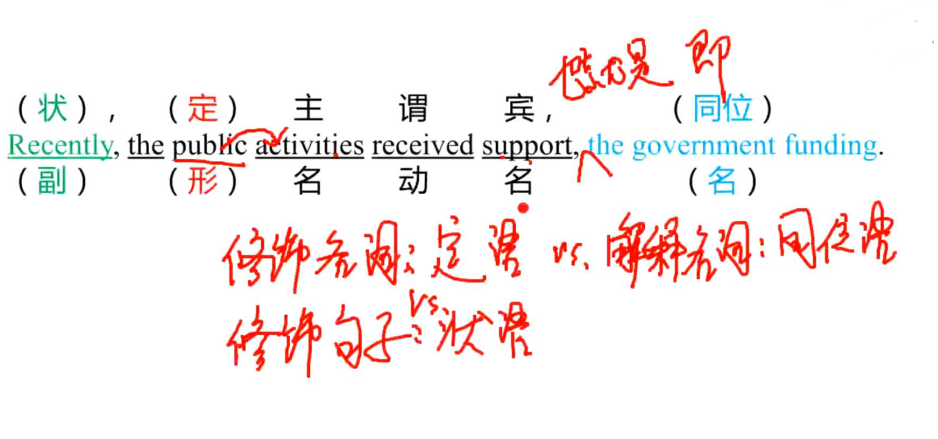

# 基本句型

## 例句_最近,这个公共的活动获得支持,也就是政府的资金
### Recently, the public activities received support, the government funding.

**总结**
- 修饰名称:定语   
- 修改句子:状态
- 解释名称:同位语   #对前面的名词进行解释,如获取什么支持,后面答:也就是政府的资金

# 简单句

## 主谓宾

## **例句_政府应该打击暴力不色情信息**
> 关键词：violence, pornography  
> Governments should fight violence and pornography.

## 过程总结
- shoult fight  辅助动词+实在动词 = 谓词动词
	- shoult 为情态动词 也叫 辅助动词
	- fight 为实实在在的动词 也叫 实义动词

## **例句_学一门外语有劣于求职**
> 关键词：contribute to  
> Learning a foreign language contributes to job hunting.

## 过程总结
-  动名词作主语
	-  learn动词要做主语,所以加 ing,变成动名词才能做主语
	-  动名词作主语,所以动名词是看作**单数**,谓语动词要加s 如contributes to
	-  案例翻译 阅读有利于学习 Reading benefits learing.
		-  read是动词,要做主语,则必须加ing 变成 reading
		-  动名词看作单三(单数第三人称),所以谓语动词要加s
	- 及物动司及不及物动词
		- fight + 名  #及物动词
		- contribute to + 名	 	#不及物动词

## 