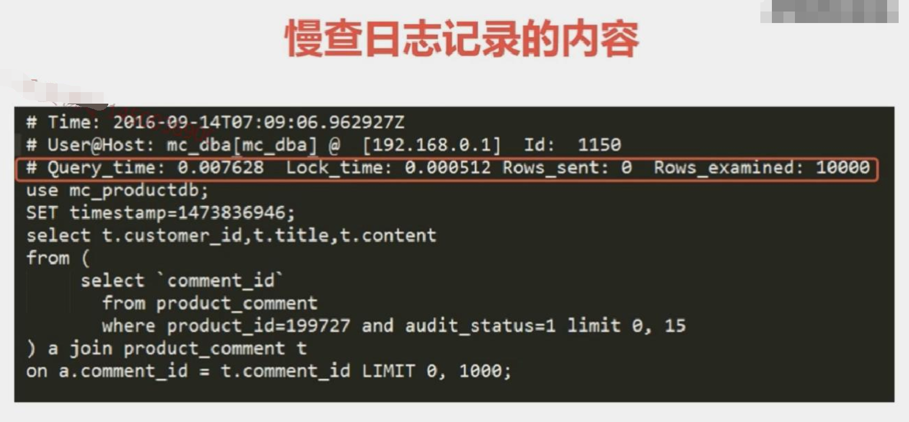
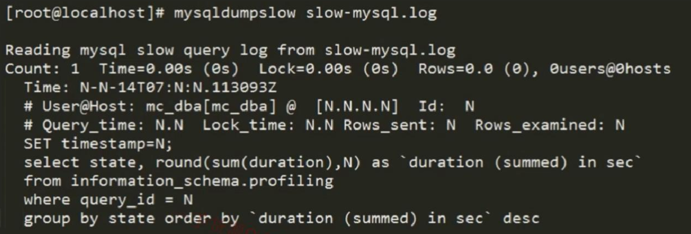

# 慢查询

## 启用mysql慢查询

```
set global slow_query_log_file = /sql_log/slow_log.log;

#未使用索引的SQL记录日志
set global log_queries_not_using_indexes = on; 

#抓取执行超过多少时间的SQL(秒)
set global long_query_time= 0.001;

set global low_query_log = on;

```

## 慢查日志记录的内容




## 如何分析慢查日志
**mysqldumpslow slow-mysql.log**




