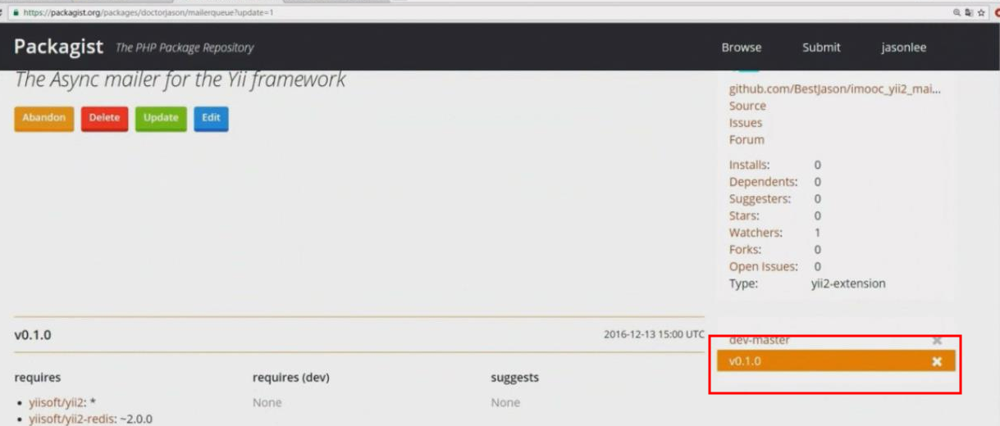

## 上传到composer

## composer.json_标准参考文件

**源代码**  
[composer.json](https://github.com/408824338/yii2_Jason/blob/master/vendor/doctorjason/mailerqueue/composer.json)

**yii2_Jason/vendor/doctorjason/mailerqueue/composer.json**

```php
{
    "name": "doctorjason/mailerqueue",

    "type": "yii2-extension",

    "description": "The Async mailer for the Yii framework",
    "keywords": ["yii2", "redis", "async", "mailer"],
    "license": "MIT",
    "support": {
        "issues": "https://github.com/xxx/imooc_yii2_mailerqueue/issues",
        "forum": "http://www.xxx.com",
        "source": "https://github.com/xxx/imooc_yii2_mailerqueue"
    },
    "authors": [
        {
            "name": "xxxx",
            "email": "xxx@qq.com"
        }
    ],

    "require": {
        "yiisoft/yii2": "*",
        "yiisoft/yii2-redis": "~2.0.0"
    },

    "autoload": {
        "psr-4": {
            "doctorjason\\mailerqueue\\": "src/"
        }
    }
}
```

## packageist设置

**填入仓库地址**


**触发勾子**


**复制如下的代码**


**获取token**


**设置token**


**输入仓库的地址**


## 使用打标签更新代码



```
git tag -a v0.1.0 -m 'update'
git push origin --tags
```

