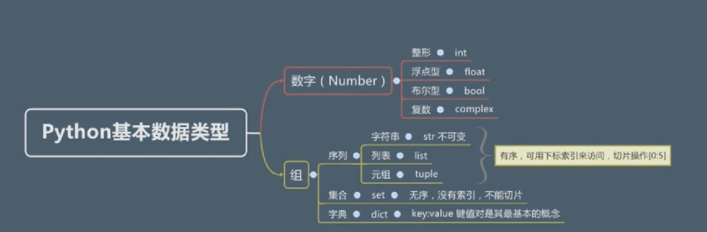

# 基础

# 基本类型


 
## 整型与浮点型
> 3.0以后 仅有 整型:int 浮点型:flost

```python
>>> type(1)
<class 'int'>
>>> type(1.1)
<class 'float'>
>>> type(1.988239827398273)
<class 'float'>
>>> 1+0.1
1.1
>>> type(1+0.1)
<class 'float'>
>>> type(1+1)
<class 'int'>
>>> 

>>> type(1*1)
<class 'int'>
>>> type(1*1.0)
<class 'float'>
>>> type(2/2)
<class 'float'>
>>> type(2//2)  // 双//强制转换为整型
<class 'int'>

>>> 2/2
1.0
>>> 2//2
1
>>> 1//2
0
```

## 10,2,8,16进制及转换

```python
>>> 0b10  #二进制转十进制
2
>>> 0b11
3
>>> 0o11  #八进制转十进制
9
>>> 0x10
16
>>> 0x1f  #十六进制转十进制
31
>>> 11   #默认十进制
11

>>> bin(10) #十进制转二进制
'0b1010'
>>> bin(0o7) #八进制转二进制
'0b111'
>>> bin(0xE) #十六进制转二进制
'0b1110'
>>> 
>>> int(0b1010) #二进制转十进制
10
>>> int(0o11) #八进制转十进制
9
>>> int(0x1f) #十六进制转十进制
31
>>> 
>>> hex(0o7777) #八进制转十六进制
'0xfff'
>>> hex(888) #十进制转十六进制
'0x378'
>>> 
>>> oct(0b111) #二进制转八进制
'0o7'
>>> oct(0x777) #十六进制转八进制
'0o3567'

```
## 布尔与复数

```python
>>> type(True)
<class 'bool'>
>>> type(False)
<class 'bool'>
>>> int(True)
1
>>> int(False)
0
>>> bool(1)
True
>>> bool(0)
False
>>> bool(-1)
True
>>> bool(2)
True
>>> bool(2.2)
True
>>> bool(0b01)
True
>>> bool(0b0)
False
>>> bool('abc')
True
>>> bool('')
False
>>> bool([1,2,3])
True
>>> bool([])
False
>>> bool({1,1,1})
True
>>> bool({})
False
>>> bool(None)
False
```

# 字符串

## 单引号与双引号

```python
>>> 1
1
>>> 2
2
>>> 'hello world'
'hello world'
>>> "Hello World"
'Hello World'
>>> 1
1
>>> '1'
'1'
>>> type(1)
<class 'int'>
>>> type('1')
<class 'str'>
>>> 
>>> 'let's go'
SyntaxError: invalid syntax
>>> "left 's go"
"left 's go"
>>> 'left "s go'
'left "s go'
>>> 'left\'s go'  #转义字符
"left's go"
>>> 
```

## 多行字符串

```python
>>> '''
hello world
hello world
hello world
'''
'\nhello world\nhello world\nhello world\n'
>>> 
>>> """
hello world
hello world
hello world
"""
'\nhello world\nhello world\nhello world\n'
>>> 
>>> "hellow world hello world hello world"
'hellow world hello world hello world'
>>> 
>>> print("""hello world\n hello world\n hello world""")
hello world
 hello world
 hello world
>>> 
>>> print('''hello world\n hello world\n hello wolrd''')
hello world
 hello world
 hello wolrd
>>> 
>>> print("hello world\nhello world\nhello world")
hello world
hello world
hello world
>>> 
>>> 'hello\
world'
'helloworld'
```

## 转义字符
> 无法"看见"的字符  
> 与语言本身语法有冲突的字符   


符号 | 描述 
---------|----------
\n | 换行
\\' | 单引号
\t | 横向制表符
\r | 回车

## 原始字符串

```python
>>> print('hello \n world')
hello 
 world
>>> 'hello \n world'
'hello \n world'
>>> 
>>> print('hello \\n world')
hello \n world
>>> 'left \'s go'
"left 's go"
>>> print('c:\northwind\northest')
c:
orthwind
orthest
>>> print('c:\\northwind\\northest')  #方法1 使用转义符输出
c:\northwind\northest
>>> 
>>> print(r'c:\northwind\northest')  #方法2 使用r表示输出,不是一个普通字符串,而是一个原始字符串
c:\northwind\northest
>>> 
```

## 字符串运算

```python
>>> 1+1
2
>>> 2*2
4
>>> "hello"+"world"
'helloworld'
>>> "hello"*3  # 该字符串输出3次
'hellohellohello'
>>> "hello"*"world" # 字符串不能乘以字符串
Traceback (most recent call last):
  File "<pyshell#4>", line 1, in <module>
    "hello"*"world"
TypeError: can't multiply sequence by non-int of type 'str'
>>> 
>>> "hello world"[0]
'h'
>>> "hello world"[3]
'l'
>>> "hello world"[4]
'o'
>>> "hello world"[-1] #获取最后一个字符
'd'
>>> "hello world"[-3] #负数,从右边开始数,第三个
'r'
>>> 
>>> "hello world"[0:4] #字长,0表示从左边开始算4个字符串
'hell'
>>> "hello world"[0:-1] #从左边到右边,截至-1个止
'hello worl'
>>> "hello world"[0:-3]
'hello wo'

>>> "hello world"[6:10]
'worl'
>>> "hello world"[6:20]
'world'
>>> "hello world"[6:-1]
'worl'
>>> "hello world"[6:-2]
'wor'
>>> "hello world"[6:0]
''
>>> "hello world"[6:-0]
''
>>> "hello world"[6:]  # 截取 从左边第6个字符开始到结束
'world'
>>> 
>>> "hello python java c# javascript php ruby"[6:]
'python java c# javascript php ruby'
>>> "hello python java c# javascript php ruby"[:-4]
'hello python java c# javascript php '
>>> "hello python java c# javascript php ruby"[-4:] #从右边数4个,然后取全部
'ruby'

>>> r'C:\windows'  #原始字符串
'C:\\windows'
>>> R'c:\windows'
'c:\\windows'
```

## 列表 

```python
>>> type([1,2,3,4,56])
<class 'list'>
>>> type(['helo','world',1,9])
<class 'list'>
>>> type(['hello','world',1,9,True,False])
<class 'list'>
>>> type([[1,2],[3,4],[True,False]])
<class 'list'>

>>> ['新月打击','苍白之爆','月之降临','月神冲刺'][0]  #获取指定数据
'新月打击'
>>> ['新月打击','苍白之爆','月之降临','月神冲刺'][3]
'月神冲刺'
>>> ['新月打击','苍白之爆','月之降临','月神冲刺'][0:2]
['新月打击', '苍白之爆']
>>> ['新月打击','苍白之爆','月之降临','月神冲刺'][-1:]
['月神冲刺']
>>> 
>>> ['新月打击','苍白之爆','月之降临','月神冲刺']+['点燃','虚弱']  # 再添加数据
['新月打击', '苍白之爆', '月之降临', '月神冲刺', '点燃', '虚弱']
>>> ['点燃','虚弱']*2  #获取多份数据
['点燃', '虚弱', '点燃', '虚弱']
>>> ['点燃','虚弱']*['点燃','虚弱']  #列表是不能相乘
Traceback (most recent call last):
  File "<pyshell#13>", line 1, in <module>
    ['点燃','虚弱']*['点燃','虚弱']
TypeError: can't multiply sequence by non-int of type 'list'
```

## 元组

```python
>>> (1,2,3,4,5)
(1, 2, 3, 4, 5)
>>> (1,'-1',True)
(1, '-1', True)
>>> (1,2,3,4)[0]
1
>>> (1,2,3,4)[0:2]
(1, 2)
>>> (1,2,3)+(4,5,6)
(1, 2, 3, 4, 5, 6)
>>> (1,2,3)*3
(1, 2, 3, 1, 2, 3, 1, 2, 3)
>>> 
>>> type((1,2,3))
<class 'tuple'>
>>> type(1)
<class 'int'>
>>> type([1,2,3])
<class 'list'>
>>> type('hello')
<class 'str'>

>>> type((1,))
<class 'tuple'>
>>> type(())
<class 'tuple'>

```

## 序列总结

```python
>>> int,float,bool,str,list,tuple
(<class 'int'>, <class 'float'>, <class 'bool'>, <class 'str'>, <class 'list'>, <class 'tuple'>)
>>> 'hello world'[2]
'l'
>>> [1,2,3][2]
3
>>> 3 in [1,2,3,4]
True
>>> 10 in [1,2,3,4]
False
>>> 3 not in [1,2,3,4]
False

>>> len([1,2,3,4,5,6])
6
>>> len('hello world')
11
>>> max([1,2,3,4,5,6])
6
>>> min([1,2,3,4,5,6])
1
>>> max('hello world')
'w'
>>> min('hello world')
' '
>>> min('helloworld')
'd'

>>> 'hello world'
'hello world'
>>> ord('w')
119
>>> ord('d')
100
>>> ord(' ')
32
```

## set集合

```python
>>> type({1,2,3,4,5})
<class 'set'>
>>> {1,2,3,4}[0]
Traceback (most recent call last):
  File "<pyshell#1>", line 1, in <module>
    {1,2,3,4}[0]
TypeError: 'set' object does not support indexing
>>> {1,2,3,4,5}[0:2]
Traceback (most recent call last):
  File "<pyshell#2>", line 1, in <module>
    {1,2,3,4,5}[0:2]
TypeError: 'set' object is not subscriptable
>>> {11,2,2,2,3,3,4,4}  # 集合的第二特殊:不重复
{3, 2, 11, 4}

>>> len({1,2,3})
3
>>> 1 in {1,2,3}
True
>>> 1 not in {1,2,3}
False
>>> [1,2,3][0]
1
>>> {1,2,3,4,5,6}-{3,4} #求两个集合的的差集
{1, 2, 5, 6}
>>> {1,2,3,4,5,6} & {3,4} #交集
{3, 4}
>>> {1,2,3,4,5,6} | {3,4,7} #合集
{1, 2, 3, 4, 5, 6, 7}

>>> type({})
<class 'dict'>
>>> type(set())
<class 'set'>
>>> len(set())
0
```

## dict字典
> 很多个key和value,集合类型(set),序列  
> key:必须是不可变的类型  

```python
>>> {'Q':'新月打击','W':'苍白之爆','E':'月之降临','R':'月神冲刺'}[0]
Traceback (most recent call last):
  File "<pyshell#0>", line 1, in <module>
    {'Q':'新月打击','W':'苍白之爆','E':'月之降临','R':'月神冲刺'}[0]
KeyError: 0
>>> {'Q':'新月打击','W':'苍白之爆','E':'月之降临','R':'月神冲刺'}['Q']
'新月打击'
>>> {'Q':'新月打击','W':'苍白之爆','E':'月之降临','R':'月神冲刺'}['R']
'月神冲刺'
>>> {'Q':'新月打击','W':'苍白之爆','E':'月之降临','R':'月神冲刺'}['Q']
'新月打击'
>>> {'Q':'新月打击','W':'苍白之爆','E':'月之降临','R':'月神冲刺'}
{'Q': '新月打击', 'W': '苍白之爆', 'E': '月之降临', 'R': '月神冲刺'}
>>> {1:'新月打击','1':'苍白之爆','E':'月之降临','R':'月神冲刺'}
{1: '新月打击', '1': '苍白之爆', 'E': '月之降临', 'R': '月神冲刺'}
>>> type({1:'新月打击','1':'苍白之爆','E':'月之降临','R':'月神冲刺'})
<class 'dict'>
>>> {[1,2]:'新月打击','1':'苍白之爆','E':'月之降临','R':'月神冲刺'}  # key:必须是不可变的类型
Traceback (most recent call last):
  File "<pyshell#7>", line 1, in <module>
    {[1,2]:'新月打击','1':'苍白之爆','E':'月之降临','R':'月神冲刺'}
TypeError: unhashable type: 'list'
>>> type({})
<class 'dict'>
```


# 条件控制

## if/elif

```python
#!/usr/bin/python3
age = int(input("请输入你的年龄"))
print("")
if age < 0:
    print("你是在逗我吧!")
elif age ==1:
    print("相当于14岁的人")
elif age == 2:
    print("相当于22岁的人")
elif age > 2:
    human  = 22 + (age -2)*5
    print("对应人类年龄:",human)

input("点击 enter 键退出")
```

## try/except/while

```python
#!/usr/bin/python3
print("=======欢迎进入狗狗年龄对比系统========")
while True:
    try:
        age = int(input("请输入您家狗的年龄:"))
        print("")
        age = float(age)
        if age < 0:
            print("您在逗我？")
        elif age == 1:
            print("相当于人类14岁")
            break
        elif age == 2:
            print("相当于人类22岁")
            break
        else:
            human = 22 + (age - 2) * 5
            print("相当于人类：", human)
            break
    except ValueError:
             print("输入不合法，请输入有效年龄")
###退出提示
input("点击 enter 键退出")

```

# while循环
## while_计算总和
```python
#!/usr/bin/python3
n=100
sum=0
counter =1
while counter <=n:
    sum =sum+counter
    counter+=1

print("1到 %d 之和为:%d" %(n,sum)) # 1到 100 之和为:5050
```

## rang计算总和
```python
#!/usr/bin/python3

sum=0
i=0;
for i in range(1,101): #n 范围 0-100
    sum += i

print(sum) 
```
**输出** 
```
5050
```

## 无限循环

```python
#!/usr/bin/python3

var =1
while var ==1:  # 表达式永远为 true
    num = int(input("输入一个数字 :"))
    print("你输入的数字是: ",num)

print("Good bye")

'''
输出
输入一个数字 :4
你输入的数字是:  4
输入一个数字 :5
你输入的数字是:  5
输入一个数字 :3
你输入的数字是:  3
输入一个数字 :5
你输入的数字是:  5
'''

```

## while循环使用else语句

```python
#!/usr/bin/python3

count =0
while count<5:
    print(count," 小于 5")
    count = count +1
else:
    print(count," 大于或等于 5")
```

**输出** 
```
0  小于 5
1  小于 5
2  小于 5
3  小于 5
4  小于 5
5  大于或等于 5
```

# for
## 循环输出数组

```python
#!/usr/bin/python3

language = ['a','b','c','d','e','f']
for x in language:
    print(x,end=',')
```

**输出** 
```
a,b,c,d,e,f,
```

## 循环使用break
```python
#!/usr/bin/python3
 
sites = ["Baidu", "Google","Runoob","Taobao"]
for site in sites:
    if site == "Runoob":
        print("菜鸟教程!")
        break
    print("循环数据 " + site)
else:
    print("没有循环数据!")
print("完成循环!")
```

**输出** 
```
循环数据 Baidu
循环数据 Google
菜鸟教程!
完成循环!
```

# break和continue
## break和continue语句及循环中的else子句
```python
for letter in 'Runoob':  # 第一个实例
    if letter == 'b':
        break
    print('当前字母为 :', letter)

var = 10  # 第二个实例
while var > 0:
    print('当期变量值为 :', var)
    var = var - 1
    if var == 5:
        break

print("Good bye!")
```
**输出** 
```
当前字母为 : R
当前字母为 : u
当前字母为 : n
当前字母为 : o
当前字母为 : o
当期变量值为 : 10
当期变量值为 : 9
当期变量值为 : 8
当期变量值为 : 7
当期变量值为 : 6
Good bye!
```
## continue语句
>continue语句被用来告诉Python跳过当前循环块中的剩余语句，然后继续进行下一轮循环。  

```python
#!/usr/bin/python3

for letter in 'Runoob':  # 第一个实例
    if letter == 'o':  # 字母为 o 时跳过输出
        continue
    print('当前字母 :', letter)

var = 10  # 第二个实例
while var > 0:
    var = var - 1
    if var == 5:  # 变量为 5 时跳过输出
        continue
    print('当前变量值 :', var)
print("Good bye!")
```

**输出** 

```
当前字母 : R
当前字母 : u
当前字母 : n
当前字母 : b
当前变量值 : 9
当前变量值 : 8
当前变量值 : 7
当前变量值 : 6
当前变量值 : 4
当前变量值 : 3
当前变量值 : 2
当前变量值 : 1
当前变量值 : 0
Good bye!
```

# 函数
# range
## 生成数列
```python
#!/usr/bin/python3

for i in range(5):
    print(i)
```
**输出** 
```
0
1
2
3
4
```
## 指定区间的值
```python
#!/usr/bin/python3

for i in range(5,9): #范围在5-8
    print(i)
```
**输出** 
```
5
6
7
8
```
## 步长
```python
#!/usr/bin/python3

for i in range(5,9,2):
    print(i)
```
**输出** 
```
5
7
```
## 结合range()和len()函数以遍历一个序列的索引
```python
#!/usr/bin/python3

a = ['Google', 'Baidu', 'Runoob', 'Taobao', 'QQ']
for i in range(len(a)):
    print(i, a[i])
    
```
**输出** 
```
0 Google
1 Baidu
2 Runoob
3 Taobao
4 QQ
```

# enumerate
## for i,j
```python
#!/usr/bin/python3

arr = [12,14,20,25,28,30,40]

for i,j in enumerate(arr):
    print(i,j)
```
**输出** 
```
0 12
1 14
2 20
3 25
4 28
5 30
6 40
```

# 迭代器
>访问集合元素的一种方式  
>迭代器是一个可以记住遍历的位置的对象。  
>迭代器对象从集合的第一个元素开始访问，直到所有的元素被访问完结束。迭代器只能往前不会后退。  
>迭代器有两个基本的方法：iter() 和 next()。  
>字符串，列表或元组对象都可用于创建迭代器：  


## 逐条输出
```python
#!/usr/bin/python3

list=[1,2,3,4]
it = iter(list)
print(next(it)) # 输出 1

print(next(it)) # 输出 2

```

## for遍历
```python
#!/usr/bin/python3

list=[1,2,3,4]
it=iter(list)
for i in it:
    print(i)
```
**输出** 
```
1
2
3
4
```
## 使用sys模块,使用next()
```python
#!/usr/bin/python3
import sys
list=[1,2,3,4]
it=iter(list)

while True:
    try:
        print(next(it))
    except StopIteration:
        sys.exit()
```
**输出** 
```
1
2
3
4
```

# 生成器
## yield实现斐波那契数列
```python
#!/usr/bin/python3
import sys

def fibonacci(n): # 生成器函数 - 斐波那契
    a, b, counter = 0, 1, 0
    while True:
        if (counter > n):
            return
        yield a
        a, b = b, a + b
        counter += 1
f = fibonacci(10) # f 是一个迭代器，由生成器返回生成

while True:
    try:
        print (next(f), end=" ")
    except StopIteration:
        sys.exit()
```
**输出** 
```
0 1 1 2 3 5 8 13 21 34 55 
```

# 匿名函数
## lambda创建匿名函数
```python
#!/usr/bin/python3

# 可写函数说明
sum = lambda s1,s2:s1+s2;

# 调用sum函数
print("相加后的值为: ",sum(10,20))
print("相加后的值为: ",sum(20,20))
```
**输出** 
```
相加后的值为:  30
相加后的值为:  40
```
# 变量作用域

## global_demo
```python
num = 1
def fun1():
    global num  # 需要使用 global 关键字声明
    print(num)
    num = 123
    print(num)
fun1()
```
**输出** 
```
1
123
```

## nonlocal_demo
>如果要修改嵌套作用域（enclosing 作用域，外层非全局作用域）中的变量则需要 nonlocal 关键字了，如下实例：  

```python
#!/usr/bin/python3

def outer():
    num = 10
    def inner():
        nonlocal num   # nonlocal关键字声明
        num = 100
        print(num)
    inner()
    print(num)
outer()
```
**输出** 
```
100
100
```

# 类对象
## 访问类的属性和方法
```python
#!/usr/bin/python3

class Father:
    i=12345
    def f(self):
        return 'hello world'

# 实例化类
x = Father()

# 访问类的属性和方法
print("访问类的属性i " ,x.i)
print("访问类的方法f ",x.f() )
```
**输出** 
```
访问类的属性i  12345
访问类的方法f  hello world
```

## 构造函数__init__
> 类方法必须包含参数 self, 且为第一个参数，self 代表的是类的实例。  

```python
#!/usr/bin/python3

class Student:
    def __init__(self,realpart,imagpart):
        self.r = realpart
        self.i = imagpart

x=Student(4,5)
print(x.r,x.i)
```
**输出** 
```
4 5

```

## self代表类的实例_而非类
>类方法必须包含参数 self, 且为第一个参数，self 代表的是类的实例。  

```python
#!/usr/bin/python3

class Student:
    def prt(self):
        print(self)
        print(self.__class__)

x=Student()
x.prt()
```
**输出** 
```
<test.Student object at 0x034C2CF0>
<class 'test.Student'>
```
### 或者将self换成别的名字
```python
#!/usr/bin/python3

class Student:
    def prt(pooo):
        print(pooo)
        print(pooo.__class__)

x=Student()
x.prt()
```
**输出** 
```
<test.Student object at 0x03092A70>
<class 'test.Student'>
```

## 类的方法_def和self
> 在类地内部，使用 def 关键字来定义一个方法，与一般函数定义不同，类方法必须包含参数 self, 且为第一个参数，self 代表的是类的实例。  

```python
#!/usr/bin/python3

#类定义
class people:
    # 定义基本属性
    name =''
    age =0
    # 定义私有属性,私有属性在类外部无法直接进行访问
    __weight =0
    # 定义构造方法
    def __init__(self,_name,_age,_weight):
        self.name = _name
        self.age = _age
        self.__weight = _weight

    def speak(self):
        print("%s 说: 我 %d 岁."%(self.name,self.age))

# 实例化类
p=people('peter',10,30)
p.speak()
print(p.name)
```
**输出** 
```
peter 说: 我 10 岁.
peter
```

## 继承

```python
#!/usr/bin/python3

class people:
    # 定义基本属性
    name = ''
    age = 0
    # 定义私有属性,私有属性在类外部无法直接进行访问
    __weight = 0

    # 定义构造方法
    def __init__(self, _name, _age, _weight):
        self.name = _name
        self.age = _age
        self.__weight = _weight

    def speak(self):
        print("%s 说: 我 %d 岁." % (self.name, self.age))


class student(people):
    grade =''
    def __init__(self, _name, _age, _weight, _grade):
        # 调用父类的构函
        people.__init__(self, _name, _age, _weight)
        self.grade = _grade

    # 覆写父类的方法
    def speak(self):
        print("%s 说:我 %d 岁了,我在读 %d 年级" %(self.name,self.age,self.grade))


# 实例化类
s = student('ken',10,60,3)
s.speak()

```
**输出** 
```
ken 说:我 10 岁了,我在读 3 年级
```

## 多继承

```python
#!/usr/bin/python3

class people:
    # 定义基本属性
    name = ''
    age = 0
    # 定义私有属性,私有属性在类外部无法直接进行访问
    __weight = 0

    # 定义构造方法
    def __init__(self, _name, _age, _weight):
        self.name = _name
        self.age = _age
        self.__weight = _weight

    def speak(self):
        print("%s 说: 我 %d 岁." % (self.name, self.age))


# 单继承示例
class student(people):
    grade = ''

    def __init__(self, _name, _age, _weight, _grade):
        # 调用父类的构函
        people.__init__(self, _name, _age, _weight)
        self.grade = _grade

    # 覆写父类的方法
    def speak(self):
        print("%s 说:我 %d 岁了,我在读 %d 年级" % (self.name, self.age, self.grade))


# 另一个类，多重继承之前的准备
class speaker():
    topic = ''
    name = ''

    def __init__(self, _name, _topic):
        self.name = _name
        self.topic = _topic

    def speak(self):
        print("我叫 %s ,我是一个演说家,我演讲的主题 %s " % (self.name, self.topic))


# 多重继承
class sample(speaker, student):
    a = ''

    def __init__(self, _name, _age, _weight, _grade, _topic):
        student.__init__(self, _name, _age, _weight, _grade)
        speaker.__init__(self, _name, _topic)


# 实例化类
test = sample("tim", 25, 80, 4, "Python")
test.speak()    #方法名同，默认调用的是在括号中排前地父类的方法

```
**输出** 
```
我叫 tim ,我是一个演说家,我演讲的主题 Python 
```

## 方法重写

```python
#!/usr/bin/python3

# 定义父类
class Zoo:
    def intro(self):
        print('动物王国')


# 定义子类
class Cat(Zoo):
    def intro(self):
        print('我是一只猫')


i = Cat()  # 子类实例
i.intro()  # 子类调用重写方法

```
**输出** 
```
我是一只猫
```

## 运算符重载

```python
#!/usr/bin/python3

class Sum:
    num1 = 0
    num2 = 0

    def __init__(self, _num1, _num2):
        self.num1 = _num1
        self.num2 = _num2

    def __str__(self):
        return 'sum_res (%d,%d) ' % (self.num1, self.num2)

    def __add__(self, other):
        return Sum(self.num1+other.num1,self.num2+other.num2)

v1 = Sum(2, 10)
v2 = Sum(15, -2)
print(v1 + v2)

```
**输出** 
```
sum_res (17,8) 
```

# Python3标准库
## 操作系统接口
```python
#!/usr/bin/python3

import os

os.getcwd() # 返回当前的工作目录
os.chdir('D:/')  # 修改当前的工作目录
os.system('mkdir test20170623') # 执行系统命令 mkdir  创建一个目录 
```
