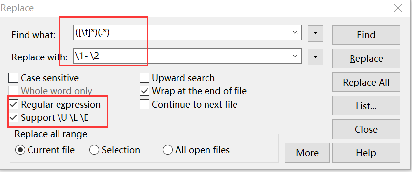

## 复制mind节点到markdown

> 文字前加-  

```
内容前加-
    ([\t]*)(.*)
    \1- \2
```




**输出前**

```
描述
	闭包 = 函数+环境变量 (函数定义时候)
	现场
	函数的外部间接访问函数内部的变量
	闭包的好处,保存着上一次的值
```

**输出后**
```
- 描述
	- 闭包 = 函数+环境变量 (函数定义时候)
	- 现场
	- 函数的外部间接访问函数内部的变量
	- 闭包的好处,保存着上一次的值

```


## 复制mindManager节点到markdown

```
查找为  ([\s]*)(.*)
替换为  \1 - \2
```
