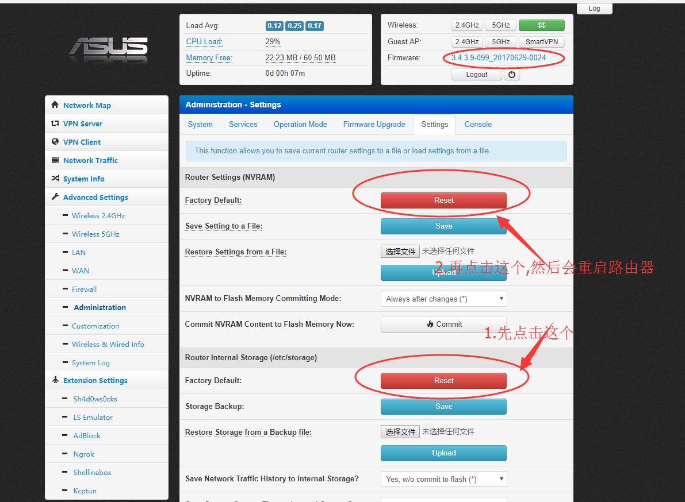
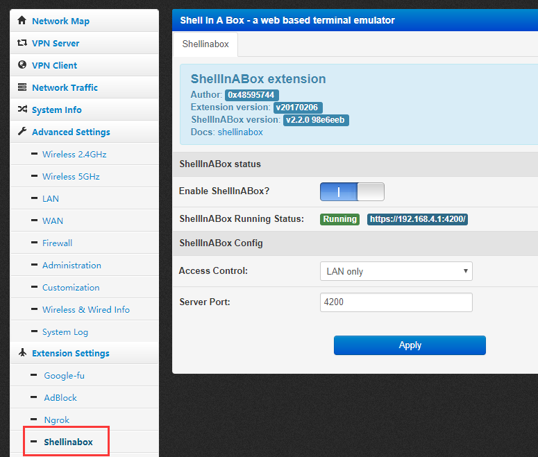
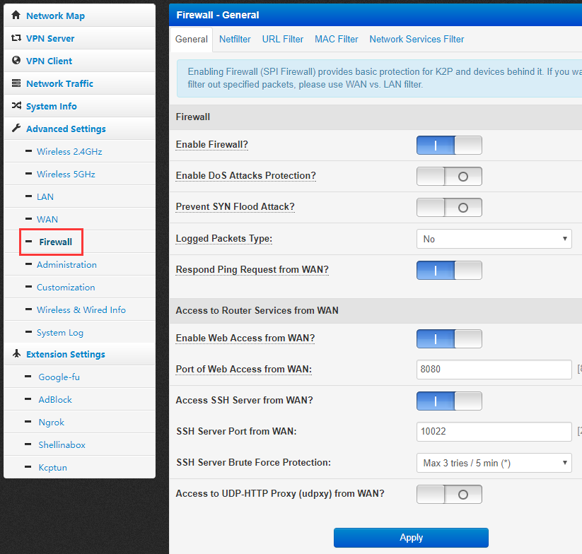
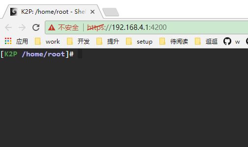
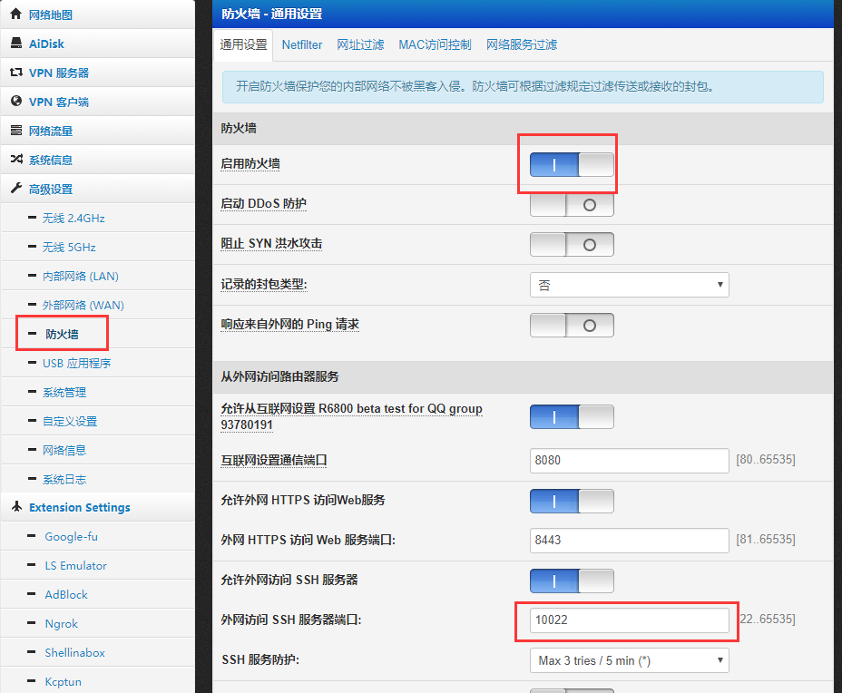
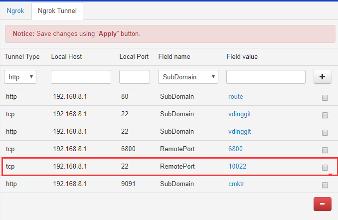
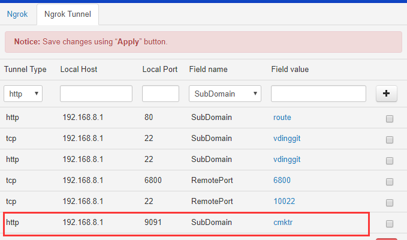
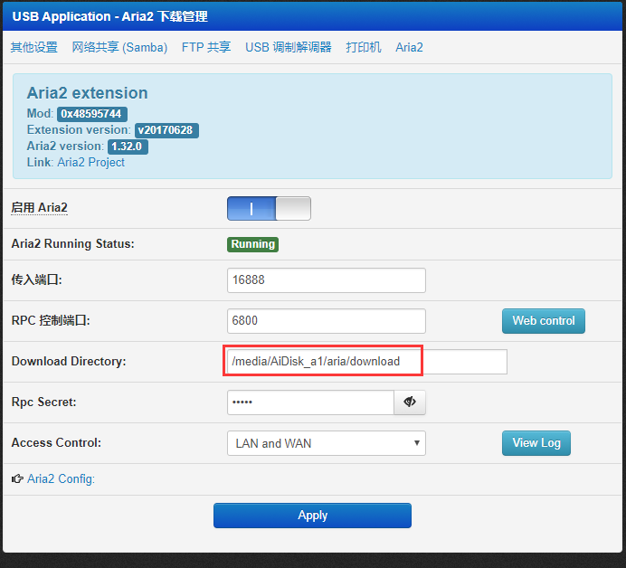

# 华硕固件配置

## 刷机之后双清

# SS的配置
## 添加节点的顺序
```
 s4.sxiami.com	 
 s5.sxiami.com	 	 	 	 
 s2.sxiami.com	 	 
 s9.sxiami.com	 	 
 s12.sxiami.com	 	 
 s11.sxiami.com	 	 
i6s1.sxiami.com	 
```

## 开启webshell
https://192.168.4.1:4200/







## ssh开启ss

```
nvram set google_fu_mode=0xDEADBEEF
nvram commit
```

# 使用U盘装Git仓库

## 启用opkg及git安装过程
>插入U盘,然后进入/media/AiDisk_a1  

```shell
[R6800 /media/AiDisk_a1]# mkdir opt
[R6800 /media/AiDisk_a1]# ls
opt
[R6800 /media/AiDisk_a1]# mount --bind /media/AiDisk_a1/opt /opt
[R6800 /media/AiDisk_a1]# mount
rootfs on / type rootfs (rw)
/dev/root on / type squashfs (ro,relatime)
proc on /proc type proc (rw,relatime)
sysfs on /sys type sysfs (rw,relatime)
usbfs on /proc/bus/usb type usbfs (rw,relatime)
tmpfs on /dev type tmpfs (rw,relatime,size=8k)
tmpfs on /etc type tmpfs (rw,noatime,size=4096k)
tmpfs on /home type tmpfs (rw,relatime,size=1024k)
tmpfs on /media type tmpfs (rw,relatime,size=8k)
tmpfs on /mnt type tmpfs (rw,relatime,size=8k)
tmpfs on /tmp type tmpfs (rw,relatime,size=24576k)
tmpfs on /var type tmpfs (rw,relatime,size=4096k)
devpts on /dev/pts type devpts (rw,relatime,mode=600)
/dev/sda1 on /media/AiDisk_a1 type ext4 (rw,noatime) //U盘的目录
/dev/sda1 on /opt type ext4 (rw,noatime) //存放仓库目录
[R6800 /media/AiDisk_a1]# opkg
-sh: opkg: not found
[R6800 /media/AiDisk_a1]# opkg.sh
Downloading http://pkg.entware.net/binaries/mipsel/Packages.gz
Updated list of available packages in /opt/var/opkg-lists/entware-ng
Installing ldconfig (1.0.17-1) to root...
Downloading http://pkg.entware.net/binaries/mipsel/ldconfig_1.0.17-1_mipselsf.ipk
Installing findutils (4.6.0-1) to root...
Downloading http://pkg.entware.net/binaries/mipsel/findutils_4.6.0-1_mipselsf.ipk
Installing libc (1.0.17-1) to root...
Downloading http://pkg.entware.net/binaries/mipsel/libc_1.0.17-1_mipselsf.ipk
Installing libgcc (5.4.0-1) to root...
Downloading http://pkg.entware.net/binaries/mipsel/libgcc_5.4.0-1_mipselsf.ipk
Installing libssp (5.4.0-1) to root...
Downloading http://pkg.entware.net/binaries/mipsel/libssp_5.4.0-1_mipselsf.ipk
Configuring ldconfig.
Configuring libgcc.
Configuring libc.
Configuring libssp.
Configuring findutils.
[R6800 /media/AiDisk_a1]# opkg install git
Installing git (2.14.1-1a) to root...
Downloading http://pkg.entware.net/binaries/mipsel/git_2.14.1-1a_mipselsf.ipk
Installing libopenssl (1.0.2l-1) to root...
Downloading http://pkg.entware.net/binaries/mipsel/libopenssl_1.0.2l-1_mipselsf.ipk
Installing zlib (1.2.11-1) to root...
Downloading http://pkg.entware.net/binaries/mipsel/zlib_1.2.11-1_mipselsf.ipk
Installing libpthread (1.0.17-1) to root...
Downloading http://pkg.entware.net/binaries/mipsel/libpthread_1.0.17-1_mipselsf.ipk
Installing librt (1.0.17-1) to root...
Downloading http://pkg.entware.net/binaries/mipsel/librt_1.0.17-1_mipselsf.ipk
Configuring libpthread.
Configuring librt.
Configuring zlib.
Configuring libopenssl.
Configuring git.
[R6800 /media/AiDisk_a1]# ls
opt
[R6800 /media/AiDisk_a1]# mkdir repo
[R6800 /media/AiDisk_a1]# cd repo
[R6800 /media/AiDisk_a1/repo]# ls
[R6800 /media/AiDisk_a1/repo]# mount
rootfs on / type rootfs (rw)
/dev/root on / type squashfs (ro,relatime)
proc on /proc type proc (rw,relatime)
sysfs on /sys type sysfs (rw,relatime)
usbfs on /proc/bus/usb type usbfs (rw,relatime)
tmpfs on /dev type tmpfs (rw,relatime,size=8k)
tmpfs on /etc type tmpfs (rw,noatime,size=4096k)
tmpfs on /home type tmpfs (rw,relatime,size=1024k)
tmpfs on /media type tmpfs (rw,relatime,size=8k)
tmpfs on /mnt type tmpfs (rw,relatime,size=8k)
tmpfs on /tmp type tmpfs (rw,relatime,size=24576k)
tmpfs on /var type tmpfs (rw,relatime,size=4096k)
devpts on /dev/pts type devpts (rw,relatime,mode=600)
/dev/sda1 on /media/AiDisk_a1 type ext4 (rw,noatime)
/dev/sda1 on /opt type ext4 (rw,noatime)
[R6800 /media/AiDisk_a1/repo]# git init --bare 
[R6800 /media/AiDisk_a1/repo]# mkdir test.git
[R6800 /media/AiDisk_a1/repo]# cd test.git/
[R6800 /media/AiDisk_a1/repo/test.git]# git init --bare
Initialized empty Git repository in /media/AiDisk_a1/repo/test.git/
[R6800 /media/AiDisk_a1/repo/test.git]# 
```

## 新仓库的创建

```
mkdir xxxx 
cd xxxx
git init --bare
```

## 获取仓库地址

**2种仓库的获取方式**

```
git clone admin@192.168.8.1:/media/AiDisk_a1/repo/test.git

git clone ssh://admin@192.168.2.92:10022/media/AiDisk_a1/repo/test.git

```

**路由器防火墙的配置**



## 外网域名访问仓库ngrok设置

> tcp协议 10022映射到内网 192.168.8.1的22端口



# 磁力链接_Transmission配置

## ngrok配置映射
> http协议 cmktr映射到内网 192.168.8.1的9091端口  
> 访问以 http://cmktr.ngrok.*.cn即可  




# aria2配置

## aria2基本配置
> 挂载的U盘目录download /media/AiDisk_a1/aria/download  
> 访问地址 



