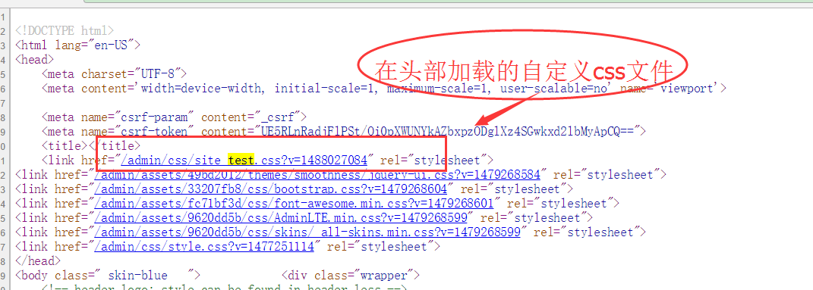

#AssetBundle简单使用
> 来源:[yii2项目实战-资源包管理](http://www.manks.top/document/yii2-asset-bundle.html)

- [自定义css和js](AssetBundle.md#自定义css和js)
- [js解决依赖关系](AssetBundle.md#js解决依赖关系)
- [view层使用](AssetBundle.md#view层使用)

##访问地址
http://ysk.dev/admin/demo-assets/index




##自定义css和js
###1.新建TestAsset.php
路径：backend/assets/TestAsset.php  

```php
namespace backend\assets;
use yii\web\AssetBundle;

class TestAsset extends AssetBundle {

    public $basePath = '@webroot';
    public $baseUrl = '@web';

    //定义自定义要加载的文件
    public $css = [
        'css/site_test.css'
    ];

    /**
     *
     *  test.js依赖jquery.js的文件
     *  1.定义一个Test2Asset存放jquery.js的文件
     *  2.本类中使用$depend来依赖即可
     * @var array
     */
    public $js = [
        'js/test.js'
    ];

    //3.设置依赖的文件路径
    public $depends=[
        'backend\assets\Test2Asset'
    ];

}

```


##js解决依赖关系
>如加载的test.js需要加载jquery.js则在新建一个Assets的文件来存放，然后来加载

###存放jquery.js文件于Test2Asset.php  
路径：backend/assets/Test2Asset.php  
```php
namespace backend\assets;

use yii\web\AssetBundle;

class Test2Asset extends AssetBundle {

    //加载jquery.js文件
    public $js=[
        '//cdn.bootcss.com/jquery/3.1.1/jquery.js'
    ];
}

```

##view层使用
```php
//加载自定义css或JS
\backend\assets\TestAsset::register($this);

<div class="testContent">测试内容</div>

```