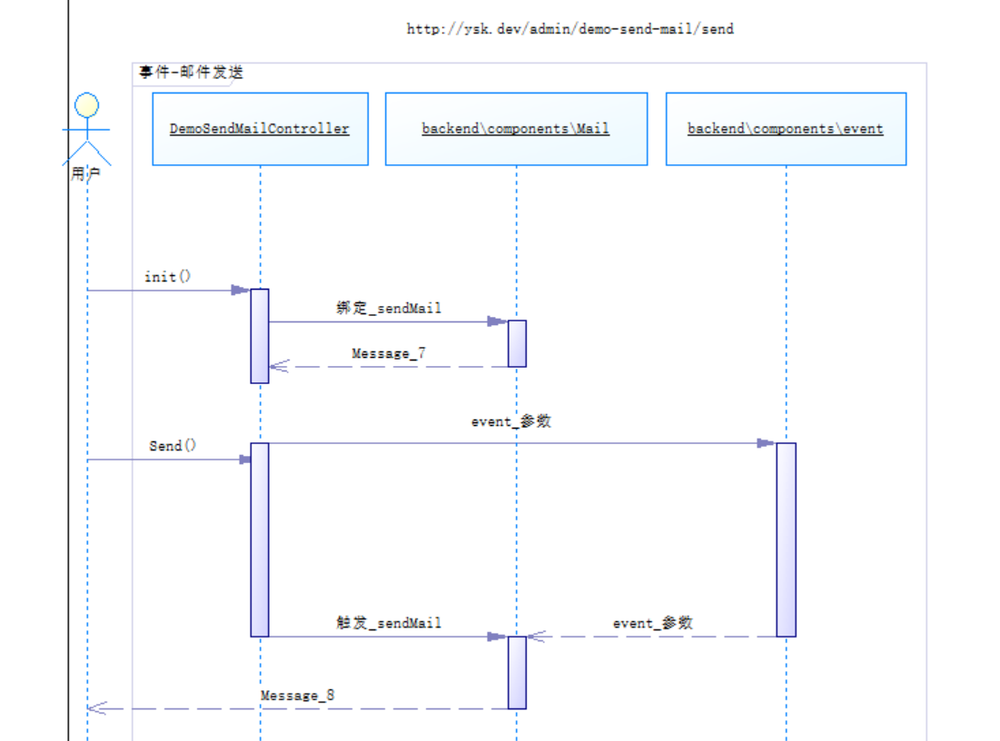

# 事件-邮件发送
>功能描述，通过event的事件要触发邮件发送  

来源:[yii2项目实战-用事件优雅的发送邮件](http://www.manks.top/document/yii2-event-email-example.html)   

## 时序图

[时序图路径](../uml/事件-邮件发送.oom)



## 访问地址
http://ysk.dev/admin/demo-send-mail/send  

## 控制器
**[backend/controllers/DemoSendMailController.php](https://github.com/408824338/test-yii2/blob/master/backend/controllers/DemoSendMailController.php)** 

```php
namespace backend\controllers;
use backend\components\event\MailEvent;
use yii\web\Controller;


class DemoSendMailController extends Controller {

	//1.定义要事件执行调用的方法名 on()和trigger(),会调用到  
    const SEND_MAIL = 'send_mail';

    public function init() {
        parent::init();
        /**
         * 2.
         * 预先绑定加载事件类-要触发的功能
         * (注：触发方法 sendMail 位于 'backend\components\Mail')，等待触发
         * 待指定的方法，如 http://ysk.dev/admin/demo-send-mail/send 则会触发
         */
        $this->on(self::SEND_MAIL, ['backend\components\Mail', 'sendMail']);

    }

    /**
     * 3.
     * 触发的方法
     * a.配置里添加 mailer组件类
     * b.添加组件 Mail类
     * c.添加event类 MailEvent
     * @author cmk
     */
    public function actionSend() {
        try {
            //1.配置邮件行为类
            $event = new MailEvent();
            $event->email = '823624320@qq.com';
            $event->subject = '测试事件邮件标题2';
            $event->content = '测试的事件的内容2';
            //
            /**
             * 2.触发函数运行
             * self::SEND_MAIL //要触发的函数方法（跟上面on()里的方法名一致）
             * $event  //上面配置的参数，传过去
             */
            $this->trigger(self::SEND_MAIL, $event);
            echo '发送成功';
        } catch (\Exception $e) {
            echo $e->getMessage();
        }
    }
}
```


## 事件_1邮件公共参数定义
>MailEvent()事件定义  

**[backend/components/event/MailEvent.php](https://github.com/408824338/test-yii2/blob/master/backend/components/event/MailEvent.php)**  

```php
<?php
namespace backend\components\event;
use yii\base\Event;
class MailEvent extends Event {
    //发送邮件地址
    public $email;
	//标题 
    public $subject;
    //内容    
	public $content;
}
```

## 事件_2不同邮件方发送方法
>为什么不跟上面的方法在一起？  
>原因在于，有不同的邮件发送商，如qq 163或自己，则分开来，为了方便管理与拓展
Mail()邮件发送的功能  

**backend/components/Mail.php**  

```php
<?php
namespace backend\components;
class Mail {

    public static function sendMail($event) {
        //1.调用邮件类
        $mail = \Yii::$app->mailer->compose();
        $mail->setTo($event->email);//要发送给那个人的邮箱
        $mail->setSubject($event->subject);//邮件主题
        $mail->setTextBody($event->content);//发布纯文字文本
        //邮件发送
        return $mail->send();
    }

}
```

## 配置添加组件mailer
**backend/config/web.php**

````php
'mailer' => [
            'class' => 'yii\swiftmailer\Mailer',
            'viewPath' => '@common/mail',
            // 这个要设置为false,才会真正的发邮件
            'useFileTransport' => false,
            'transport' => [
                'class' => 'Swift_SmtpTransport',
                // 如果是163邮箱，host改为smtp.163.com
                'host' => 'smtp.qq.com',
                // 邮箱登录帐号
                'username' => '408824338@qq.com',
                // 如果是qq邮箱，这里要填写第三方授权码，而不是你的qq登录密码，参考qq邮箱的帮助文档
                //http://service.mail.qq.com/cgi-bin/help?subtype=1&&id=28&&no=1001256
                'password' => 'hlbzsiaytqtlbjjj',
                'port' => '25',
                'encryption' => 'tls',
            ],
            'messageConfig'=>[
                'charset'=>'UTF-8',
                'from'=>['408824338@qq.com'=>'cmk-mail-test']
            ],
        ],

```

