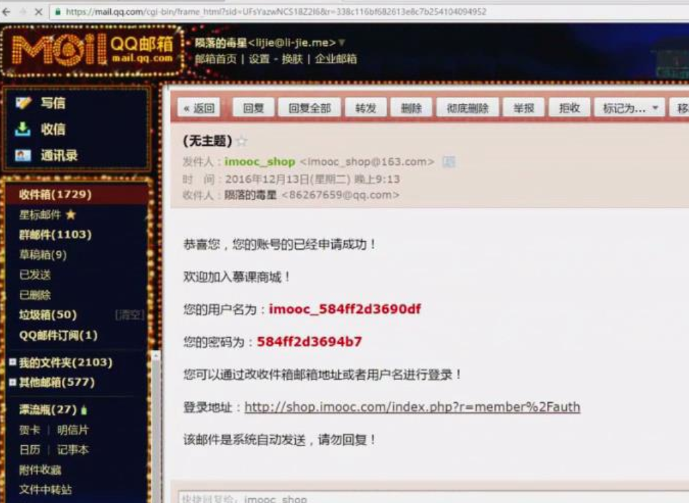

# 使用队列redis发送邮件

## 邮件配置信息
**源代码**  
[web.php](https://github.com/408824338/yii2_Jason/blob/master/config/web.php)

**/yii2_Jason/config/web.php**

```php
'components' => [
    'redis' => [
            'class' => 'yii\redis\Connection',
            'hostname' => 'localhost',
            'port' => 6379,
            'database' => 0,
        ],*/   
    'mailer' => [
        //'class' => 'yii\swiftmailer\Mailer',
         'class' => 'doctorjason\mailerqueue\MailerQueue',  //继承yii\swiftmailer\Mailer类,重载发送方法  (自定义邮件类_使用队列redis发送)
         'db' => '1',
         'key' => 'mails',
        // send all mails to a file by default. You have to set
        // 'useFileTransport' to false and configure a transport
        // for the mailer to send real emails.
        'useFileTransport' => false,
        'transport' => [
            'class' => 'Swift_SmtpTransport',
            'host' => 'smtp.163.com',
            'username' => 'imooc_shop@163.com',
            'password' => 'imooc123',
            'port' => '465',
            'encryption' => 'ssl',
        ],
    ],
]    
```


## 注册邮件入队列


**源代码**  
[MemberController.php](https://github.com/408824338/yii2_Jason/blob/master/controllers/MemberController.php)  
[User.php](https://github.com/408824338/yii2_Jason/blob/master/models/User.php) user model

**yii2_Jason/controllers/MemberController.php**

```php
<?php
namespace app\controllers;
use app\controllers\CommonController;
use app\models\User;
use Yii;
class MemberController extends CommonController
{
    protected $except = ['auth', 'logout', 'reg', 'qqreg', 'qqlogin', 'qqcallback'];
 public function actionReg()
    {
        $model = new User;
        if (Yii::$app->request->isPost) {
            $post = Yii::$app->request->post();
            if ($model->regByMail($post)) { //邮件入队列
                Yii::$app->session->setFlash('info', '电子邮件发送成功');
            }
        }
        $this->layout = 'layout2';
        return $this->render('auth', ['model' => $model]);
    }
}
```

**yii2_Jason/models/User.php**                                                                                                                            
```php
<?php
namespace app\models;
use yii\db\ActiveRecord;
use Yii;
class User extends ActiveRecord implements \yii\web\IdentityInterface
{
    public $repass;
    public $loginname;
    public $rememberMe = true;
    public static function tableName()
    {
        return "{{%user}}";
    }

    public function rules()
    {
        return [
            ['loginname', 'required', 'message' => '登录用户名不能为空', 'on' => ['login']],
            ['openid', 'required', 'message' => 'openid不能为空', 'on' => ['qqreg']],
            ['username', 'required', 'message' => '用户名不能为空', 'on' => ['reg', 'regbymail', 'qqreg']],
            ['openid', 'unique', 'message' => 'openid已经被注册', 'on' => ['qqreg']],
            ['username', 'unique', 'message' => '用户已经被注册', 'on' => ['reg', 'regbymail', 'qqreg']],
            ['useremail', 'required', 'message' => '电子邮件不能为空', 'on' => ['reg', 'regbymail']],
            ['useremail', 'email', 'message' => '电子邮件格式不正确', 'on' => ['reg', 'regbymail']],
            ['useremail', 'unique', 'message' => '电子邮件已被注册', 'on' => ['reg', 'regbymail']],
            ['userpass', 'required', 'message' => '用户密码不能为空', 'on' => ['reg', 'login', 'regbymail', 'qqreg']],
            ['repass', 'required', 'message' => '确认密码不能为空', 'on' => ['reg', 'qqreg']],
            ['repass', 'compare', 'compareAttribute' => 'userpass', 'message' => '两次密码输入不一致', 'on' => ['reg', 'qqreg']],
            ['userpass', 'validatePass', 'on' => ['login']],
        ];
    }

   //邮件入队列
    public function regByMail($data)
    {
        $data['User']['username'] = 'imooc_'.uniqid();
        $data['User']['userpass'] = uniqid();
        $this->scenario = 'regbymail';
        if ($this->load($data) && $this->validate()) {
            $mailer = Yii::$app->mailer->compose('createuser', ['userpass' => $data['User']['userpass'], 'username' => $data['User']['username']]);
            $mailer->setFrom('imooc_shop@163.com');
            $mailer->setTo($data['User']['useremail']);
            $mailer->setSubject('慕课商城-新建用户');
            //if ($mailer->send() && $this->reg($data, 'regbymail')) {
            if ($mailer->queue() && $this->reg($data, 'regbymail')) {  //$mailer->queue() 继承Message类,实现将邮件发送到队列里云,位置于 yii2_Jason/vendor/doctorjason/mailerqueue/src/Message.php
                return true;
            }
        }
        return false;
    }
}    
```

## 自定义邮件类_使用队列redis发送
>  继承\yii\swiftmailer\Mailer  


**源代码**  
[MailerQueue.php](https://github.com/408824338/yii2_Jason/blob/master/vendor/doctorjason/mailerqueue/src/MailerQueue.php)   

**yii2_Jason/vendor/doctorjason/mailerqueue/src/MailerQueue.php**

```php
<?php
namespace doctorjason\mailerqueue;
use Yii;
class MailerQueue extends \yii\swiftmailer\Mailer
{
    public $messageClass = "doctorjason\mailerqueue\Message";  //指定Message类,将邮件入库到队列里去
    public $key = 'mails';
    public $db = '1';


    public function process()
    {
        $redis = Yii::$app->redis;
        if (empty($redis)) {
            throw new \yii\base\InvalidConfigException('redis not found in config.');
        }
        if ($redis->select($this->db) && $messages = $redis->lrange($this->key, 0, -1)) {
            $messageObj = new Message;  //实例化,当前目录文件Message.php 
            foreach ($messages as $message) {
                $message = json_decode($message, true);
                //信息为空,或者数据信息有误,则报错
                if (empty($message) || !$this->setMessage($messageObj, $message)) {
                    throw new \ServerErrorHttpException('message error');
                }
                //发送成功,则将reids队列里的数据删除
                if ($messageObj->send()) {
                    $redis->lrem($this->key, -1, json_encode($message));
                }
            }
        }
        return true;
    }

    //构造邮件体数据
    public function setMessage($messageObj, $message) 
    {
        if (empty($messageObj)) {
            return false;
        }
        if (!empty($message['from']) && !empty($message['to'])) {
            $messageObj->setFrom($message['from'])->setTo($message['to']);
            if (!empty($message['cc'])) {
                $messageObj->setCc($message['cc']);
            }
            if (!empty($message['bcc'])) {
                $messageObj->setBcc($message['bcc']);
            }
            if (!empty($message['reply_to'])) {
                $messageObj->setReplyTo($message['reply_to']);
            }
            if (!empty($message['charset'])) {
                $messageObj->setCharset($message['charset']);
            }
            if (!empty($message['subject'])) {
                $messageObj->setSubject($message['subject']);
            }
            if (!empty($message['html_body'])) {
                $messageObj->setHtmlBody($message['html_body']);
            }
            if (!empty($message['text_body'])) {
                $messageObj->setTextBody($message['text_body']);
            }
            return $messageObj;
        }
        return false;
    }
}
```

## 将发送邮件入redis队列去

**源代码**  
[Message.php](https://github.com/408824338/yii2_Jason/blob/master/vendor/doctorjason/mailerqueue/src/Message.php)

**yii2_Jason/vendor/doctorjason/mailerqueue/src/Message.php**

```php
<?php
namespace doctorjason\mailerqueue;
use Yii;
class Message extends \yii\swiftmailer\Message
{
    public function queue()
    {
        $redis = Yii::$app->redis;
        if (empty($redis)) {
            throw new \yii\base\InvalidConfigException('redis not found in config.');
        }
        // 0 - 15  select 0 select 1
        // db => 1
        $mailer = Yii::$app->mailer;
        if (empty($mailer) || !$redis->select($mailer->db)) {
            throw new \yii\base\InvalidConfigException('db not defined.');
        }
        $message = [];
        $message['from'] = array_keys($this->from);
        $message['to'] = array_keys($this->getTo());
        $message['cc'] = array_keys($this->getCc());
        $message['bcc'] = array_keys($this->getBcc());
        $message['reply_to'] = array_keys($this->getReplyTo());
        $message['charset'] = array_keys($this->getCharset());
        $message['subject'] = array_keys($this->getSubject());
        $parts = $this->getSwiftMessage()->getChildren();
        if (!is_array($parts) || !sizeof($parts)) {
            $parts = [$this->getSwiftMessage()];
        }
        foreach ($parts as $part) {
            if (!$part instanceof \Swift_Mime_Attachment) {
                switch($part->getContentType()) {
                    case 'text/html':
                        $message['html_body'] = $part->getBody();
                        break;
                    case 'text/plain':
                        $message['text_body'] = $part->getBody();
                        break;
                }
                if (!$message['charset']) {
                    $message['charset'] = $part->getCharset();
                }
            }
        }
        return $redis->rpush($mailer->key, json_encode($message));
    }
}
```


## 命令行下触发邮件发送

## console邮件配置信息

**源代码**  
[web.php](https://github.com/408824338/yii2_Jason/blob/master/config/web.php)

```php
'components' => [
'redis' => [
        'class' => 'yii\redis\Connection',
        'hostname' => 'localhost',
        'port' => 6379,
        'database' => 0,
    ],
'mailer' => [
        //'class' => 'yii\swiftmailer\Mailer',
            'class' => 'doctorjason\mailerqueue\MailerQueue',
            'db' => '1',
            'key' => 'mails',
        // send all mails to a file by default. You have to set
        // 'useFileTransport' to false and configure a transport
        // for the mailer to send real emails.
        'useFileTransport' => false,
        'transport' => [
            'class' => 'Swift_SmtpTransport',
            'host' => 'smtp.163.com',
            'username' => 'imooc_shop@163.com',
            'password' => 'imooc123',
            'port' => '465',
            'encryption' => 'ssl',
        ],
    ],      
]      
```

## console执行发送操作

**源代码** 
[MailerController.php](https://github.com/408824338/yii2_Jason/blob/master/commands/MailerController.php)

**yii2_Jason/commands/MailerController.php**

```php
<?php
/**
 * @link http://www.yiiframework.com/
 * @copyright Copyright (c) 2008 Yii Software LLC
 * @license http://www.yiiframework.com/license/
 */
namespace app\commands;
use yii\console\Controller;
/**
 * This command echoes the first argument that you have entered.
 *
 * This command is provided as an example for you to learn how to create console commands.
 *
 * @author Qiang Xue <qiang.xue@gmail.com>
 * @since 2.0
 */
class MailerController extends Controller
{
    /**
     * This command echoes what you have entered as the message.
     * @param string $message the message to be echoed.
     */
    public function actionSend()
    {
        \Yii::$app->mailer->process();
    }
}
```


```
./yii mailer/send //发放
```


## 使用定时任务触邮件发送



