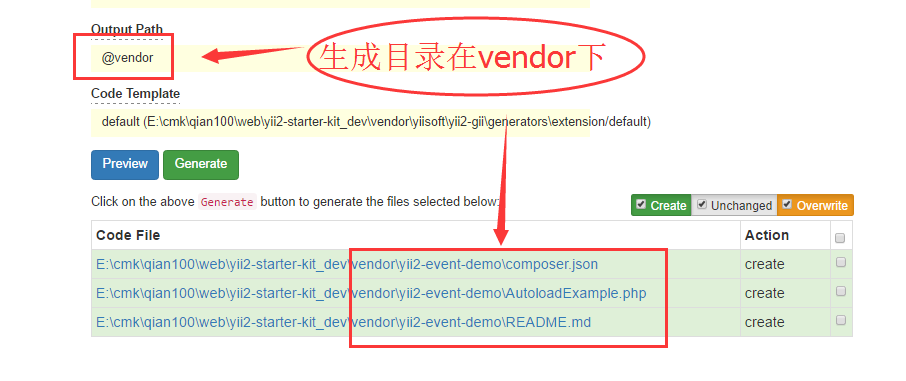
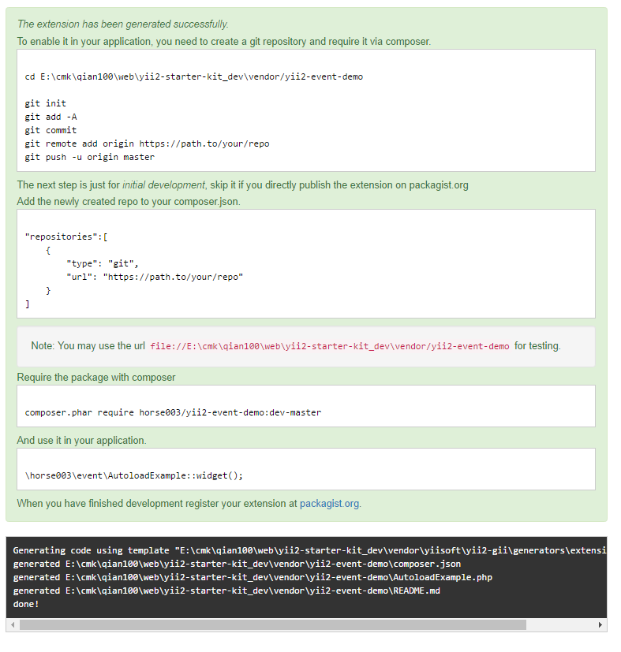

#扩展

##自定义扩展
>猫与老鼠事件

###1.实现gii生成extension

##自定义路径

##生成结果

#### 生成之后
```php
The extension has been generated successfully.
To enable it in your application, you need to create a git repository and require it via composer.

cd E:\cmk\qian100\web\yii2-starter-kit_dev\vendor/yii2-event-demo

git init
git add -A
git commit
git remote add origin https://path.to/your/repo
git push -u origin master
The next step is just for initial development, skip it if you directly publish the extension on packagist.org
Add the newly created repo to your composer.json.

"repositories":[
    {
        "type": "git",
        "url": "https://path.to/your/repo"
    }
]
Note: You may use the url file://E:\cmk\qian100\web\yii2-starter-kit_dev\vendor/yii2-event-demo for testing.
Require the package with composer

composer.phar require horse003/yii2-event-demo:dev-master
And use it in your application.

\horse003\event\AutoloadExample::widget();
When you have finished development register your extension at packagist.org.
```

##注：会向几处写入信息
- vendor\composer\autoload_psr4.php
- vendor/yiisoft/extensions.php

##访问的路径
http://ysk.dev/admin/demo-event/animal  