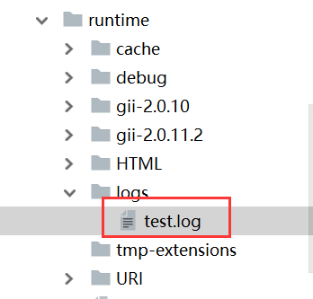
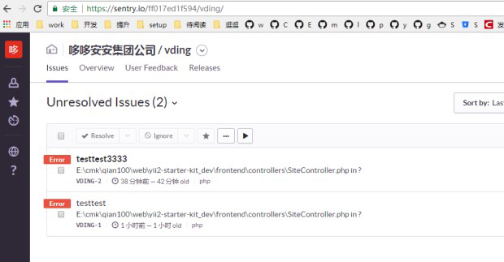
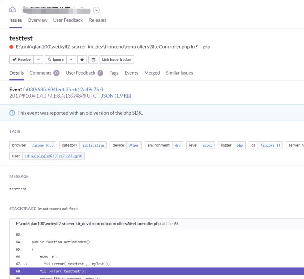

# 日志

# 自定义监控的错误类型与过滤多余日志信息

## 自定义log配置

```php
'components'     => [
        'log'                => [
            'traceLevel' => YII_DEBUG ? 3 : 0,
            'targets'    => [
                'db' => [
                    'class'    => 'yii\log\DbTarget',
                    'levels'   => ['error', 'warning'],
                    'except'   => ['yii\web\HttpException:*', 'yii\i18n\I18N\*'],
                    'prefix'   => function () {
                        $url = !Yii::$app->request->isConsoleRequest ? Yii::$app->request->getUrl() : null;
                        return sprintf('[%s][%s]', Yii::$app->id, $url);
                    },
                    'logVars'  => [],
                    'logTable' => '{{%system_log}}',
                ],
                [
                    'class'  => 'yii\log\FileTarget',
                    'levels' => ['error', 'warning'],  //入库的错误类型
                    'logFile'=>'@app/runtime/logs/test.log', //指定文件
                    'categories'=>['myTest'],  //使用的标识
                    'logVars'=>[]  //过滤多余的内容,即只存储我入库的信息
                ]
            ],
        ],
]
```
## 操作记录入库

```php
Yii::error('testtest','myTest');

```

**截图展示**




# 使用sentry收集错误log

## sentry安装

[yii2-sentry官方安装](https://github.com/hellowearemito/yii2-sentry)

```
php composer.phar require --prefer-dist mito/yii2-sentry "~1.0.0"

"mito/yii2-sentry": "~1.0.0"
```

## sentry配置

```php
    'components' => [

        'sentry' => [
            'class' => 'mito\sentry\Component',
            'dsn' => 'YOUR-PRIVATE-DSN', // private DSN
            'environment' => 'staging', // if not set, the default is `production`
            'jsNotifier' => true, // to collect JS errors. Default value is `false`
            'jsOptions' => [ // raven-js config parameter
                'whitelistUrls' => [ // collect JS errors from these urls
                    'http://staging.my-product.com',
                    'https://my-product.com',
                ],
            ],
        ],
        'log' => [
            'targets' => [
                [
                    'class' => 'mito\sentry\Target',
                    'levels' => ['error', 'warning'],
                    'except' => [
                        'yii\web\HttpException:404',
                    ],
                ],
            ],
        ],

    ],
```

## sentry操作

```php
Yii::error('testtest','myTest');
```

**截图展示**






# logreader

## logreader配置
**common/config/base.php**
```php
'modules' => [
    'logreader' => [
        'class' => 'zabachok\logreader\Module',
        'sources' => [
            '@company/runtime/logs/error',
            '@rest/runtime/logs',
            '@frontend/runtime/logs',
        ],
    ],
]
```
## logreader使用
> http://i.t2.vding.wang/logreader  


