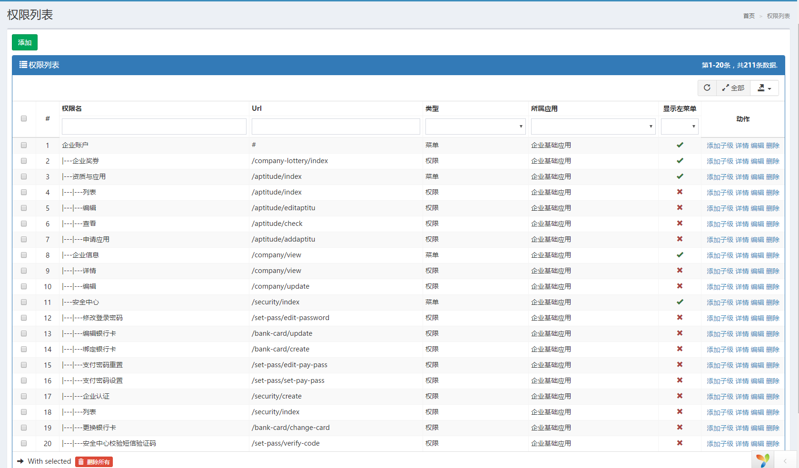

# 权限

## 企业后台_globalAccesss配置

```php
'as globalAccess'=>[
         'class'=>'\common\behaviors\GlobalAccessBehavior',
         'rules'=>[
             [
                 'controllers'=>['sign-in'],
                 'allow' => true,
                 'roles' => ['?'],
                 'actions'=>['login']
             ],
             [
                 'controllers'=>['sign-in'],
                 'allow' => true,
                 'roles' => ['@'],
                 'actions'=>['logout']
             ],
             [
                 'controllers'=>['site'],
                 'allow' => true,
                 'roles' => ['?', '@'],
                 'actions'=>['error']
             ],
             [
                 'controllers'=>['debug/default'],
                 'allow' => true,
                 'roles' => ['?'],
             ],
             [
                 'controllers'=>['user'],
                 'allow' => true,
                 'roles' => ['administrator'],
             ],
             [
                 'controllers'=>['user'],
                 'allow' => false,
             ],
             [
                 'allow' => true,
                 'roles' => ['manager'],
             ]
         ]
     ]
];
```

## 企业后台权限控制_v1

[源代码](rabc/企业后台权限控制_v1)  

### 自定义globalAccesss配置

**company/config/web.php**

```php
 'as globalAccess'=>[
        'class'=>'\common\behaviors\GlobalAccessBehavior',
        'accessControlFilter' => 'common\filters\UrlAccessFilter',
        'rules'=>[
            
        ]
    ],
```


# 3个表

## 表的数据结构
```

#auth_assign

CREATE TABLE `auth_assign` (
  `auth_item_id` int(11) NOT NULL,
  `auth_item_name` varchar(64) CHARACTER SET utf8 COLLATE utf8_bin NOT NULL COMMENT '角色名、权限名',
  `user_id` int(11) NOT NULL,
  `company_id` int(11) NOT NULL COMMENT '企业ID',
  `created_at` int(11) DEFAULT NULL,
  `updated_at` int(11) DEFAULT NULL,
  PRIMARY KEY (`auth_item_id`,`user_id`,`company_id`)
) ENGINE=InnoDB DEFAULT CHARSET=utf8 COMMENT='用户关联角色表'


# auth_item

CREATE TABLE `auth_item` (
  `id` int(11) unsigned NOT NULL AUTO_INCREMENT COMMENT '主键ID',
  `name` varchar(64) CHARACTER SET utf8 COLLATE utf8_bin NOT NULL COMMENT '角色名、权限名',
  `url` varchar(64) CHARACTER SET utf8 COLLATE utf8_bin DEFAULT NULL,
  `industry_appid` tinyint(11) DEFAULT NULL COMMENT '企业开通的应用//look_up(industry_appid)',
  `company_id` int(11) DEFAULT '0' COMMENT '企业ID 0表示共用',
  `parent_id` int(11) DEFAULT '0' COMMENT '父级',
  `type` tinyint(4) NOT NULL COMMENT '类型：1角色 2权限,3 特殊权限,4 菜单',
  `description` text CHARACTER SET utf8 COLLATE utf8_bin COMMENT '描述',
  `visible` tinyint(4) DEFAULT '1' COMMENT '是否显示//0 否，1 是',
  `level` tinyint(4) DEFAULT '0' COMMENT '级别//-1 type为角色时,0 应用（模块级）， 1 控制器， 2  操作 ',
  `depth` int(4) DEFAULT '0' COMMENT '节点深度// 顶级 0 ， 一级 1，  二级 2 ， 三级 3 ... (程序如果需要可以使用这个字段）',
  `status` tinyint(11) unsigned DEFAULT '1' COMMENT '状态 1有效 0无效',
  `sort` mediumint(8) DEFAULT '0' COMMENT '排序，值越大，排越前',
  `created_at` int(11) DEFAULT NULL,
  `updated_at` int(11) DEFAULT NULL,
  `is_platform` tinyint(4) DEFAULT '0' COMMENT '是否为平台角色权限 1:是 0:不是',
  PRIMARY KEY (`id`),
  KEY `type` (`type`) USING BTREE,
  KEY `company_id` (`company_id`) USING BTREE,
  KEY `url` (`url`) USING BTREE,
  KEY `id` (`id`)
) ENGINE=InnoDB AUTO_INCREMENT=4617 DEFAULT CHARSET=utf8 COMMENT='角色、权限表'


#auth_item_child

CREATE TABLE `auth_item_child` (
  `parent` int(11) NOT NULL COMMENT 'auth_item=>id type=1',
  `child` int(11) NOT NULL COMMENT 'auth_item=>id type=2',
  PRIMARY KEY (`parent`,`child`),
  KEY `child` (`child`)
) ENGINE=InnoDB DEFAULT CHARSET=utf8 COMMENT='角色权限关联表'

```

## auth_item

### 列表页
>http://i.vding.dev/route/




### 创建页

> 访问的地址:http://i.vding.dev/route/create


```php
/**
 * 新增
 * @return mixed
 */
public function actionCreate()
{
    $request = Yii::$app->request;
    $model = new AuthItem();  
    
    $model->type = 1;
    if ($model->load($request->post()) && $model->save()) {
        return $this->redirect(['view', 'id' => $model->id]);
    } else {
        $parent_id = $request->get('id',0);
        $model->parent_id = $parent_id;
        $look_data = Lookup::find()->where(['type'=>'industry_appid'])->asArray()->all();
        $industry_appid = ArrayHelper::map($look_data, 'code','name');
        return $this->render('create', [
            'model' => $model,
            'industry_appid'=>$industry_appid
        ]);
    }

   
}

```