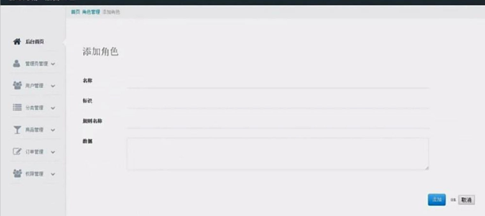
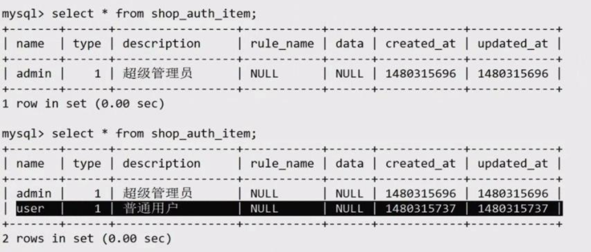
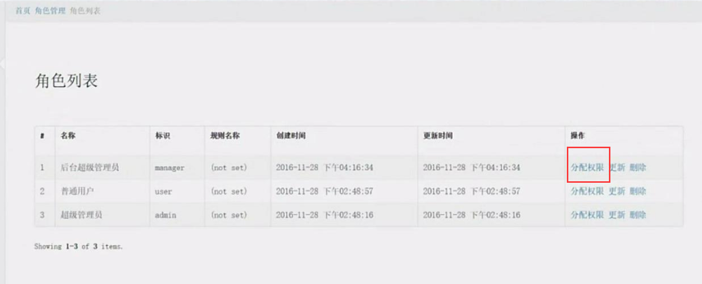
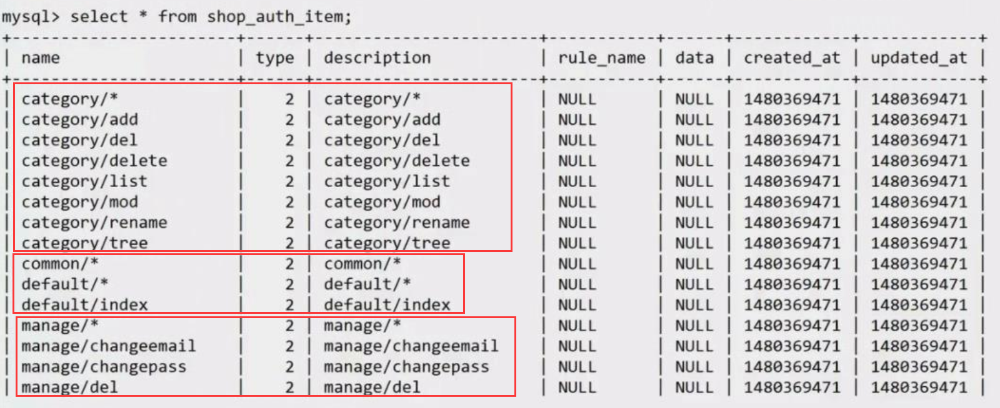
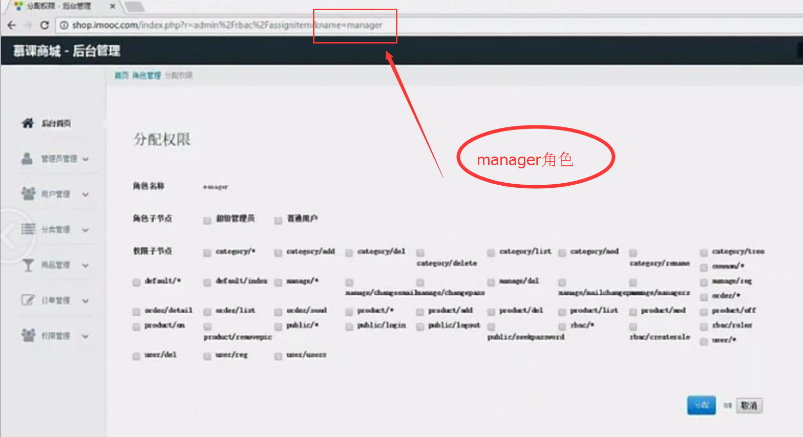
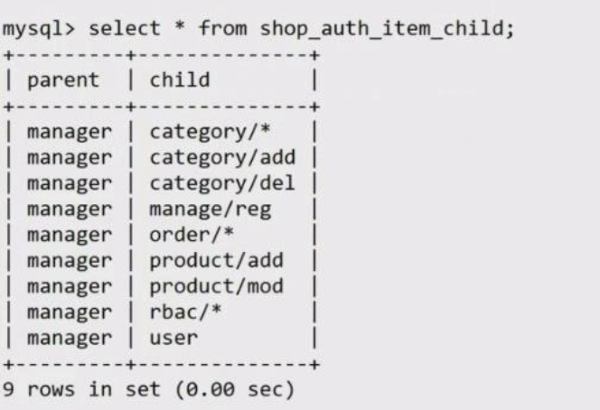
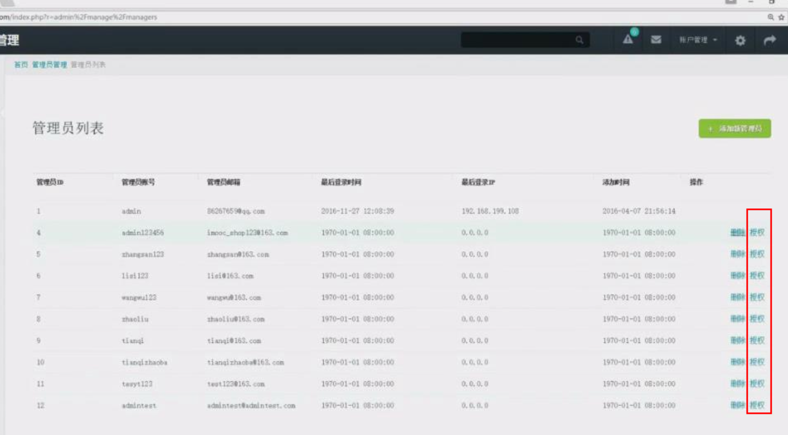

# RBAC慕课开发平台

## 数据库表介绍
- 存储角色或权限表 auth_item
- 用户权限关联表   auth_item_child
- 用户角色(权限)表 auth_assignment
- 规则表          auth_rule

## 基本类介绍
- yii\rbac\Item  角色或者权限的基类,用户字段type来区分
- yii\rbac\Role  Role为代表用户的类
- yii\rbac\Permission  控制权限操作的类
- yii\rbac\Assignment  用户与角色关联
- yii\rbac\Rule        判断角色权限的额外规则  
 
## 配置文件

**源代码**  
[web.php](https://github.com/408824338/yii2_Jason/blob/master/config/web.php)   

**yii2_Jason/config/web.php**
```php
'components' => [
    'authManager' => [
        'class' => 'yii\rbac\DbManager',
        // auth_item (role permission)
        // auth_item_child (role->permission)
        // auth_assignment (user->role)
        // auth_rule (rule)
        'itemTable' => '{{%auth_item}}',
        'itemChildTable' => '{{%auth_item_child}}',
        'assignmentTable' => '{{%auth_assignment}}',
        'ruleTable' => '{{%auth_rule}}',
        'defaultRoles' => ['default'],
    ],
]
```

## 生成权限表

**源代码**  
[console.php](https://github.com/408824338/yii2_Jason/blob/master/config/console.php)  

### 配置console

**yii2_Jason/config/console.php**
```php
$config = [
    'components' => [
        'authManager' => [
            'class' => 'yii\rbac\DbManager',
            // auth_item (role permission)
            // auth_item_child (role->permission)
            // auth_assignment (user->role)
            // auth_rule (rule)
            'itemTable' => '{{%auth_item}}',
            'itemChildTable' => '{{%auth_item_child}}',
            'assignmentTable' => '{{%auth_assignment}}',
            'ruleTable' => '{{%auth_rule}}',
        ],
    ]
]
```

### 运行yii生成

**网站根目录执行**
```php
./yii migrate --migrationPath=@yii/rbac/migrations
```


## 创建角色

**源代码**  
[RbacController.php](https://github.com/408824338/yii2_Jason/blob/master/modules/controllers/RbacController.php)  
[__createitem.php](https://github.com/408824338/yii2_Jason/blob/master/modules/views/rbac/_createitem.php)  视图文件  



**yii2_Jason/modules/controllers/RbacController.php**

```php
namespace app\modules\controllers;
use Yii;
use \yii\data\ActiveDataProvider;
use \yii\db\Query;
use app\modules\models\Rbac;
class RbacController extends CommonController
{
    public $mustlogin = ['createrule', 'createrole', 'roles', 'assignitem'];
    public function actionCreaterole()
    {
        if (Yii::$app->request->isPost) {
            $auth = Yii::$app->authManager;
            $role = $auth->createRole(null);
            $post = Yii::$app->request->post();
            if (empty($post['name']) || empty($post['description'])) {
                throw new \Exception('参数错误');
            }
            $role->name = $post['name'];
            $role->description = $post['description'];
            $role->ruleName = empty($post['rule_name']) ? null : $post['rule_name'];
            $role->data = empty($post['data']) ? null : $post['data'];
            if ($auth->add($role)) {
                Yii::$app->session->setFlash('info', '添加成功');
            }
        }
        return $this->render('_createitem');
    }
}    
```

**结果展示**



## 创建权限列表及分页



**源代码**  
[RbacController.php](https://github.com/408824338/yii2_Jason/blob/master/modules/controllers/RbacController.php)  
[_items.php](https://github.com/408824338/yii2_Jason/blob/master/modules/views/rbac/_items.php)  视图文件


**yii2_Jason/modules/controllers/RbacController.php**

```php
namespace app\modules\controllers;
use Yii;
use \yii\data\ActiveDataProvider;
use \yii\db\Query;
use app\modules\models\Rbac;
class RbacController extends CommonController
{
      public $mustlogin = ['createrule', 'createrole', 'roles', 'assignitem'];

    //角色列表  
    public function actionRoles()
    {
        $auth = Yii::$app->authManager;
        $data = new ActiveDataProvider([
            'query' => (new Query)->from($auth->itemTable)->where('type = 1')->orderBy('created_at desc'),
            'pagination' => ['pageSize' => 5],
        ]);
        return $this->render('_items', ['dataProvider' => $data]);
    }      
}    
```

**/yii2_Jason/modules/views/rbac/_items.php**

视图文件

```php
 <?php
    echo GridView::widget([
        'dataProvider' => $dataProvider,
        'columns' => [
            [
                'class' => 'yii\grid\SerialColumn',
            ],
            'description:text:名称',
            'name:text:标识',
            'rule_name:text:规则名称',
            'created_at:datetime:创建时间',
            'updated_at:datetime:更新时间',
            [
                'class' => 'yii\grid\ActionColumn',
                'header' => '操作',
                'template' => '{assign} {update} {delete}',
                'buttons' => [
                    'assign' => function ($url, $model, $key) {
                        return Html::a('分配权限', ['assignitem', 'name' => $model['name']]);
                    },
                    'update' => function ($url, $model, $key) {
                        return Html::a('更新', ['updateitem', 'name' => $model['name']]);
                    },
                    'delete' => function ($url, $model, $key) {
                        return Html::a('删除', ['deleteitem', 'name' => $model['name']]);
                    }
                ],
            ],
        ],
        'layout' => "\n{items}\n{summary}<div class='pagination pull-right'>{pager}</div>",
    ]);
?>
```

## 批量导入控制器的方法入数据库

**源代码**  
[RbacController.php](https://github.com/408824338/yii2_Jason/blob/master/commands/RbacController.php)

**yii2_Jason/commands/RbacController.php**

```php
<?php
namespace app\commands;
use Yii;
use yii\console\Controller;
class RbacController extends Controller
{
    // yii rbac/init
    // category/* category/add category/delete
    public function actionInit()
    {
        $trans = Yii::$app->db->beginTransaction();
        try {
            $dir = dirname(dirname(__FILE__)). '/modules/controllers';
            $controllers = glob($dir. '/*');
            $permissions = [];
            foreach ($controllers as $controller) {
                $content = file_get_contents($controller);
                preg_match('/class ([a-zA-Z]+)Controller/', $content, $match);
                $cName = $match[1];
                $permissions[] = strtolower($cName. '/*');
                preg_match_all('/public function action([a-zA-Z_]+)/', $content, $matches);
                foreach ($matches[1] as $aName) {
                    $permissions[] = strtolower($cName. '/'. $aName);
                }
            }
            $auth = Yii::$app->authManager;
            foreach ($permissions as $permission) {
                if (!$auth->getPermission($permission)) {
                    $obj = $auth->createPermission($permission);
                    $obj->description = $permission;
                    $auth->add($obj);
                }
            }
            $trans->commit();
            echo "import success \n";
        } catch(\Exception $e) {
            $trans->rollback();
            echo "import failed \n";
        }
    }
}

```

**根目录下运行**
./yii                                                                                                                                                                                      
This is Yii version 2.0.12.                                                                       
                                                                                                  
The following commands are available:                                                             
                                                                                                  
- app                                         @author Eugene Terentev <eugene@terentev.net>       
    app/set-executable                                                                            
    app/set-keys                                                                                  
    app/set-writable                                                                              
    app/setup                                                                                     
    app/token                                                                                     
                                                                                                  
 - hello
    hello/index (default)                                                                                                 

 - rbac
    rbac/init (default)

./yii rbac/init
import success

**数据库查询输出**




## 对某角色_分配角色或权限
> 卖点:角色可以再分配指定的角色  

**源代码**   
[RbacController.php](https://github.com/408824338/yii2_Jason/blob/master/commands/RbacController.php)    
[_assignitem.php](https://github.com/408824338/yii2_Jason/blob/master/modules/views/rbac/_assignitem.php) 视图文件   
[Rbac.php](https://github.com/408824338/yii2_Jason/blob/master/modules/models/Rbac.php) model  


**yii2_Jason/modules/controllers/RbacController.php**
```php
<?php
namespace app\modules\controllers;
use Yii;
use \yii\data\ActiveDataProvider;
use \yii\db\Query;
use app\modules\models\Rbac;
class RbacController extends CommonController
{
    public $mustlogin = ['createrule', 'createrole', 'roles', 'assignitem'];

    //
    public function actionAssignitem($name)
    {
        $name = htmlspecialchars($name); //前端传过来的 manager 角色名称
        $auth = Yii::$app->authManager;
        $parent = $auth->getRole($name); //获取批定角色 object
        if (Yii::$app->request->isPost) {
            $post = Yii::$app->request->post();
            if (Rbac::addChild($post['children'], $name)) {
                Yii::$app->session->setFlash('info', '分配成功');
            }
        }

        //$auth->getRoles() 获取所有的角色
        //$auth->getPermissions() 获取所有的权限
        $children = Rbac::getChildrenByName($name);  //获取自己已选中的角色和权限
        $roles = Rbac::getOptions($auth->getRoles(), $parent); //获取-所有角色节点
        $permissions = Rbac::getOptions($auth->getPermissions(), $parent);//获取-所有权限节点
        return $this->render('_assignitem', ['parent' => $name, 'roles' => $roles, 'permissions' => $permissions, 'children' => $children]);
    }
}    
```

**yii2_Jason/modules/views/rbac/_assignitem.php**



```php
<div class="container">
        <?php
        if (Yii::$app->session->hasFlash('info')) {
            echo Yii::$app->session->getFlash('info');
        }
        $form = ActiveForm::begin([
            'fieldConfig' => [
                'template' => '<div class="span12 field-box">{label}{input}</div>{error}',
            ],
            'options' => [
                'class' => 'new_user_form inline-input',
            ],
        ]);
        ?>
        <div class="span12 field-box">
        <?php echo Html::label('角色名称', null). Html::encode($parent); ?>
        </div>
        <div class="span12 field-box">
        <?php echo Html::label('角色子节点', null). Html::checkboxList('children', $children['roles'], $roles); ?>
        </div>
        <div class="span12 field-box">
        <?php echo Html::label('权限子节点', null). Html::checkboxList('children', $children['permissions'], $permissions); ?>
        </div>
        
        <div class="span11 field-box actions">
            <?php echo Html::submitButton('分配', ['class' => 'btn-glow primary']); ?>
            <span>OR</span>
            <?php echo Html::resetButton('取消', ['class' => 'reset']); ?>
        </div>
    <?php ActiveForm::end(); ?>
</div>
```

**yii2_Jason/modules/models/Rbac.php**

```php
<?php
namespace app\modules\models;
use yii\db\ActiveRecord;
use Yii;
class Rbac extends ActiveRecord 
{
    /**
     * 对角色和权限_生成复选框
     * $data  数据包
     * $parent  //指定角色的对象 即 auth_item.type = 1 的指定记录
    */
    public static function getOptions($data, $parent)
    {
        $return = [];
        foreach ($data as $obj) {
            //过滤显示 && 是否已经添加
            if (!empty($parent) && $parent->name != $obj->name && Yii::$app->authManager->canAddChild($parent, $obj)) {
                $return[$obj->name] = $obj->description;
            }
            if (is_null($parent)) {
                $return[$obj->name] = $obj->description;
            }
        }
        return $return;
    }

    //对某个角色 添加角色或权限
    public static function addChild($children, $name)
    {
        $auth = Yii::$app->authManager;
        $itemObj = $auth->getRole($name);
        if (empty($itemObj)) {
            return false;
        }
        $trans = Yii::$app->db->beginTransaction();
        try {
            $auth->removeChildren($itemObj);
            foreach ($children as $item) {
                $obj = empty($auth->getRole($item)) ? $auth->getPermission($item) : $auth->getRole($item);
                $auth->addChild($itemObj, $obj);
            }
            $trans->commit();
        } catch(\Exception $e) {
            $trans->rollback();
            return false;
        }
        return true;
    }

   //根据角色$name 获取已经分配的角色和权限
    public static function getChildrenByName($name)
    {
        if (empty($name)) {
            return [];
        }
        $return = [];
        $return['roles'] = [];
        $return['permissions'] = [];
        $auth = Yii::$app->authManager;

        //获取 auth_item_child.parent 等于 name ,即获取分配的角色或权限列表
        $children = $auth->getChildren($name);
        if (empty($children)) {
            return [];
        }
        foreach ($children as $obj) {
            if ($obj->type == 1) { //角色
                $return['roles'][] = $obj->name;
            } else {
                $return['permissions'][] = $obj->name;
            }
        }
        return $return;
    }    
}    
```

**查询sql输出**

manager 角色 分配角色和权限




## 对指定用户_分配角色或权限



**源代码**   
[ManageController.php](https://github.com/408824338/yii2_Jason/blob/master/modules/controllers/ManageController.php)  
[_assign.php](https://github.com/408824338/yii2_Jason/blob/master/modules/views/manage/_assign.php) 视图文件  
[Rbac.php](https://github.com/408824338/yii2_Jason/blob/master/modules/models/Rbac.php) model  

**yii2_Jason/modules/controllers/ManageController.php**

```php
<?php
namespace app\modules\controllers;
use yii\web\Controller;
use Yii;
use app\modules\models\Admin;
use yii\data\Pagination;
use app\modules\controllers\CommonController;
use app\modules\models\Rbac;
class ManageController extends CommonController
{
    protected $mustlogin = ['assign', 'mailchangepass', 'managers', 'reg', 'del', 'changeemail', 'changepass'];

    //对某个用户进行 角色或权限 的授权
    public function actionAssign($adminid)
    {
        $adminid = (int)$adminid;
        if (empty($adminid)) {
            throw new \Exception('参数错误');
        }
        $admin = Admin::findOne($adminid);
        if (empty($admin)) {
            throw new \yii\web\NotFoundHttpException('admin not found');
        }
        if (Yii::$app->request->isPost) {
            $post = Yii::$app->request->post();
            $children = !empty($post['children']) ? $post['children'] : [];
            if (Rbac::grant($adminid, $children)) {
                Yii::$app->session->setFlash('info', '授权成功');
            }
        }
        $auth = Yii::$app->authManager;
        $roles = Rbac::getOptions($auth->getRoles(), null); //获取所有的角色
        $permissions = Rbac::getOptions($auth->getPermissions(), null); //获取所有的权限
        $children = Rbac::getChildrenByUser($adminid); //获取指定用户ID的已经分配的角色与权限
        return $this->render('_assign', ['children' => $children, 'roles' => $roles, 'permissions' => $permissions, 'admin' => $admin->adminuser]);
    }

}    
```

**yii2_Jason/modules/views/manage/_assign.php**

```php
<div class="container">
        <?php
        if (Yii::$app->session->hasFlash('info')) {
            echo Yii::$app->session->getFlash('info');
        }
        $form = ActiveForm::begin([
            'fieldConfig' => [
                'template' => '<div class="span12 field-box">{label}{input}</div>{error}',
            ],
            'options' => [
                'class' => 'new_user_form inline-input',
            ],
        ]);
?>
        <div class="span12 field-box">
        <?php echo Html::label('管理员', null). Html::encode($admin); ?>
        </div>
        <div class="span12 field-box">
        <?php echo Html::label('角色', null). Html::checkboxList('children', $children['roles'], $roles); ?>
        </div>
        <div class="span12 field-box">
        <?php echo Html::label('权限', null). Html::checkboxList('children', $children['permissions'], $permissions); ?>
        </div>
        
        <div class="span11 field-box actions">
            <?php echo Html::submitButton('授权', ['class' => 'btn-glow primary']); ?>
            <span>OR</span>
            <?php echo Html::resetButton('取消', ['class' => 'reset']); ?>
        </div>
    <?php ActiveForm::end(); ?>
</div>
```

**yii2_Jason/modules/models/Rbac.php**

```php
<?php
namespace app\modules\models;
use yii\db\ActiveRecord;
use Yii;
class Rbac extends ActiveRecord 
{
    /**
     * 对角色和权限_生成复选框
     * $data  数据包
     * $parent  //指定角色的对象 即 auth_item.type = 1 的指定记录
    */
    public static function getOptions($data, $parent)
    {
        $return = [];
        foreach ($data as $obj) {
            if (!empty($parent) && $parent->name != $obj->name && Yii::$app->authManager->canAddChild($parent, $obj)) {
                $return[$obj->name] = $obj->description;
            }
            //对某个用户授权 所增加
            if (is_null($parent)) {
                $return[$obj->name] = $obj->description;
            }
        }
        return $return;
    }    

    /**
     * 对指定用户分配角色与权限
     * $adminid  int //user_id
     * $children obj    //分配的角色与权限
    */
    public static function grant($adminid, $children)
    {
        $trans = Yii::$app->db->beginTransaction();
        try {
            $auth = Yii::$app->authManager;
            $auth->revokeAll($adminid); //清空该用户之前所分配的角色与权限
            foreach ($children as $item) {
                //判断当前是角色还是权限
                $obj = empty($auth->getRole($item)) ? $auth->getPermission($item) : $auth->getRole($item);
                $auth->assign($obj, $adminid);
            }
            $trans->commit();
        } catch (\Exception $e) {
            $trans->rollback();
            return false;
        }
        return true;
    }    

    //获取指定用户ID的已经分配的角色与权限
    public static function getChildrenByUser($adminid)
    {
        $return = [];
        $return['roles'] = self::_getItemByUser($adminid, 1);
        $return['permissions'] = self::_getItemByUser($adminid, 2);
        return $return;
    }    
}    
```