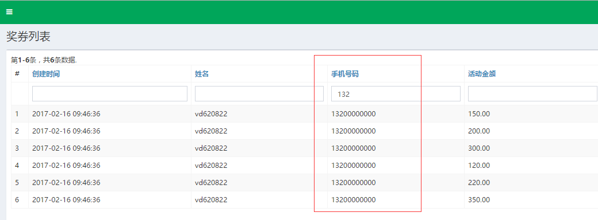

#model关联多表的使用
1. model的配置
2. 列表页设置

##managesearch方法_个性化+自定义配置
company/modules/coshop/models/search/ProductSearch.php  
```php
 public function managesearch($params)
    {
        $company_id = Yii::$app->user->getCompanyId();//对应的产品表公司ID
        $query = Product::find();
        $query->joinWith(['supplierApp', 'dpLine', 'sourceProduct']);
        $sql = "product.*,supplier_app.address,dp_line.start_address,source_product.number as p_number,source_product.name as p_product_name";
        $sql .= ",(select pricelist.id from pricelist where pricelist.product_id =product.id and  pricelist.is_default = 1 limit 1) as pricelist_id";
        $sql .= ",(SELECT IFNULL(SUM(dp_order_detail.quantity),0) AS _quantity FROM dp_order_detail LEFT JOIN dp_order ON dp_order.id = dp_order_detail.order_id WHERE dp_order_detail.product_id=product.id) as _sell_stock";//产品销量 (自己卖)

        //$sql .= ",(SELECT IFNULL(SUM((FLOOR((pricelist.end_at - pricelist.start_at)/(3600*24))+1) * pricelist.max_count),0) FROM pricelist WHERE pricelist.product_id = product.id ) as _total_stock";//产品总库存
        //$sql .=",(SELECT IFNULL(SUM(dp_order_detail.quantity),0) FROM dp_order_detail  WHERE dp_order_detail.product_id  = product.id) AS _all_sell_quantity "; //  （多级卖出的数据 ）

       //分销商取源头product.original_product_id，否则取product.id
        $sql .=",(select f_get_product_stock(if(product.original_product_id,product.original_product_id,product.id),-1)) as _total_stock";
        $sql .=",(select f_get_supplier_name(product.id )) as supplier_name";
        $query->select(new Expression($sql));
        //$query->where('product.is_deleted=0');
        // echo  $query->createCommand()->getRawSql();exit;
//        dp($params);
        //上下架状态//状态  -1 全部 -2 已售完 1 上架 0 下架
        switch (intval($params['is_on_sale'])) {
            case -1:
                $query->where('product.company_id=:_company_id', ['_company_id' => $company_id]);
                break;
            case -2:
                $query->where('(SELECT IFNULL(SUM((ROUND((pricelist.end_at - pricelist.start_at)/(3600*24))+1) * pricelist.max_count),0) FROM pricelist WHERE pricelist.product_id = product.id ) - (SELECT IFNULL(SUM(dp_order_detail.quantity),0) AS _quantity FROM dp_order_detail LEFT JOIN dp_order ON dp_order.id = dp_order_detail.order_id WHERE dp_order_detail.product_id=product.id) = 0  and product.company_id=:_company_id', ['_company_id' => $company_id]);
                break;
            case 0:
                $query->where('product.is_on_sale= 0 and product.company_id=:_company_id', ['_company_id' => $company_id]);
                break;
            case 1:
                $query->where('product.is_on_sale= 1 and product.company_id=:_company_id', ['_company_id' => $company_id]);
                break;
            default:
                break;
        }

        $query->andWhere('product.is_deleted=0 and product.is_published_store = 1 and product.is_free = 0 ');

        $dataProvider = new ActiveDataProvider([
            'query' => $query,
        ]);
        //  echo $query->createCommand()->getRawSql();exit;
        $dataProvider->setSort([
            'attributes' =>
                ArrayHelper::merge(
                    [
                        'address', 'start_address', 'supplier_name'
                    ], array_keys(parent::attributeLabels())
                )
        ]);

        //  dp($params);
        $this->load($params);

        if (!$this->validate()) {
            // uncomment the following line if you do not want to return any records when validation fails
            // $query->where('0=1');
            return $dataProvider;
        }
        // grid filtering conditions
        $query->andFilterWhere([
            'id' => $this->id,
            'supplier_id' => $this->supplier_id,
            'supplier_company_id' => $this->supplier_company_id,
            'category_id' => $this->category_id,
            'status' => $this->status,
            'product.sys_category_id' => $this->sys_category_id,
            'is_refund' => $this->is_refund,
            'max_count' => $this->max_count,
            'original_product_id' => $this->original_product_id,
            'parent_product_id' => $this->parent_product_id,
            'created_by' => $this->created_by,
            'created_at' => $this->created_at,
            'updated_at' => $this->updated_at,
        ]);
//        dp($this->address);
        $query->andFilterWhere(['like', 'product.name', $this->name])
            ->andFilterWhere(['like', 'source_product.name', $this->p_product_name])
            ->andFilterWhere(['like', 'source_product.number', $this->p_number])
            ->andFilterWhere(['like', 'supplier_name', $this->supplier_name])
            ->andFilterWhere(['like', 'product.number', $this->number])
            ->andFilterWhere(['like', 'supplier_app.address', $this->address])
            ->andFilterWhere(['like', 'dp_line.start_address', $this->start_address]);

        return $dataProvider;
    }


```

## 列表页使用
index.php 
>使用关联表的字段

```php
[// 线路 - 出发地
                'attribute' => 'start_address',
                'value' => function ($model) {
                    return isset($model->dpLine->start_address) ? $model->dpLine->start_address : null;
                },
                'filter' => Html::activeTextInput($searchModel, 'start_address', ['class' => 'form-control']),
                'visible' => intval(Yii::$app->request->get('type'))  == 2
            ],
```


#search关联用户表取username

>举例场景 
>在用户奖券表(user_activity表)里显示的列表里，显示有user表的username


- 配置model
	- [1_配置UserActivity模型](model.md#1_配置useractivity模型)
	- [2_配置UserActivitySearch模型](model.md#2_配置useractivity_search模型)
	- [3_列表页显示](model.md#3_列表页显示)

##1_配置useractivity模型
```php
class UserActivity extends \common\models\***Model{
  //1.定义变量
  public $username;     #关联user表

  //2.设置显示的命名
    public function attributeLabels()
    {
        return [
			...
            'username' => '姓名',
            ...

        ];
    }
 
  //3.关联的表
    public function getUser()
    {
        return $this->hasOne(User::className(), ['id' => 'user_id']);
    }
}

```

##2_配置useractivity_search模型
```php
class UserActivitySearch extends UserActivity{

   //1.在规则里将 username列入safe   
    public function rules()
    {
        return [
            [
 			...
            [['username'], 'safe'],
			...
        ];
    }

  public function search($params)
    {
        $query = UserActivity::find();

		/*1.定义关联user表，这个user是 UserActivity下的函数getUser
          注：如果该函数下的getUserLog的话，这个时候调用的命名应该为 userLog
		 (格式：第一个大写省略，第二个大写要写上，否则会报错)
		*/  
        $query->joinWith(['user']);  
        $sql ="user_activity.*,user.username"; 

        $query->select(new Expression($sql));

        $dataProvider = new ActiveDataProvider([
            'query' => $query,
        ]);

        //2.关联表的字段入库，否则在列表页不能搜索
        $dataProvider->setSort([
            'attributes' =>
                ArrayHelper::merge(
                    [
                        'username'
                    ], array_keys(parent::attributeLabels())
                )
        ]);

        if (!($this->load($params) && $this->validate())) {
            return $dataProvider;
        }

        $query->andFilterWhere([
            'id' => $this->id,
            'user_id' => $this->user_id,
            'activity_id' => $this->activity_id,
            'ticket_type' => $this->ticket_type,
            'amount' => $this->amount,
            'status' => $this->status,
            'used_at' => $this->used_at,
            'valid_start_at' => $this->valid_start_at,
            'valid_end_at' => $this->valid_end_at,
            'created_at' => $this->created_at,
            'updated_at' => $this->updated_at,
        ]);

        $query
            ->andFilterWhere(['like', 'name', $this->name])
            //3.增加搜索条件
            ->andFilterWhere(['like','username',$this->username]);

        return $dataProvider;
    }


}

```

##3_列表页显示
index.php
```php
		[//关联表user.name
            'attribute' => 'username',
            'value' => function ($model) {
                return isset($model->user->username) ? $model->user->username : null;
            },
            'filter' => Html::activeTextInput($searchModel, 'username', ['class' => 'form-control']),
        ],

```

#search关联用户表取mobile以别名形式

>举例场景 
>在用户奖券表(user_activity表)里显示的列表里，显示有user表的mobile,与上面例子不一样的是，我们以别名的方式（关联多表时，相同的字段是有的，即会采用别名）



- 配置model
	- [a_配置UserActivity模型](model.md#a_配置useractivity模型)
	- [b_配置UserActivitySearch模型](model.md#b_配置useractivity_search模型)
	- [c_列表页显示](model.md#c_列表页显示)

##a_配置useractivity模型
```php

class UserActivity extends \common\models\***Model{
  //1.定义变量
 public $user_mobile;   #关联user表

  //2.设置显示的命名
    public function attributeLabels()
    {
        return [
			...
            'user_mobile' => '手机号码',
            ...

        ];
    }
 
  //3.关联的表
    public function getUser()
    {
        return $this->hasOne(User::className(), ['id' => 'user_id']);
    }
}
```

##b_配置useractivity_earch模型

```php
 class UserActivitySearch extends UserActivity{

   //1.在规则里将 username列入safe   
    public function rules()
    {
        return [
            [
 			...
            [['user_mobile'], 'safe'],
			...
        ];
    }

  public function search($params)
    {
        $query = UserActivity::find();

		/*1.定义关联user表，这个user是 UserActivity下的函数getUser
          注：如果该函数下的getUserLog的话，这个时候调用的命名应该为 userLog
		 (格式：第一个大写省略，第二个大写要写上，否则会报错)
		*/  
        $query->joinWith(['user']);  
        $sql ="user_activity.*,user.mobile as user_mobile"; 

        $query->select(new Expression($sql));

        $dataProvider = new ActiveDataProvider([
            'query' => $query,
        ]);

        //2.关联表的字段入库，否则在列表页不能搜索
        $dataProvider->setSort([
            'attributes' =>
                ArrayHelper::merge(
                    [
                        'username'
                    ], array_keys(parent::attributeLabels())
                )
        ]);

        if (!($this->load($params) && $this->validate())) {
            return $dataProvider;
        }

		...
        $query
            ->andFilterWhere(['like', 'name', $this->name])
            //3.增加搜索条件(注：搜索的字段不能别名来搜索)
            ->andFilterWhere(['like','user.mobile',$this->user_mobile]);

        return $dataProvider;
    }


}


```

##c_列表页显示

```php
index.php
```php
		[//关联表user.name
            'attribute' => 'username',
            'value' => function ($model) {
                return isset($model->user->username) ? $model->user->username : null;
            },
            'filter' => Html::activeTextInput($searchModel, 'username', ['class' => 'form-control']),
        ],

```
```