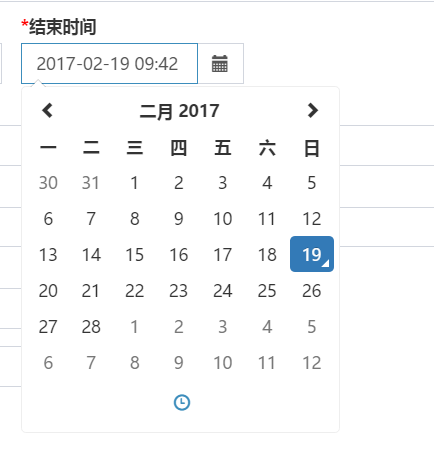
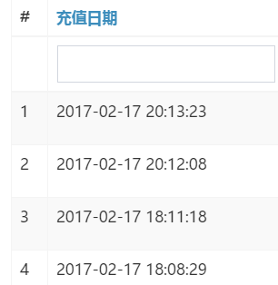
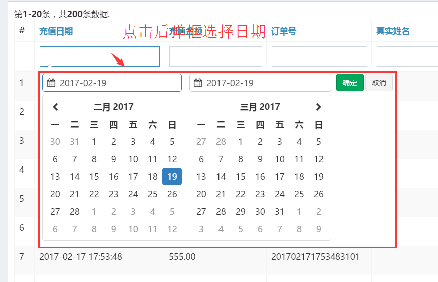
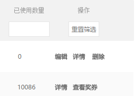

##输入框选择日期


```php
        <?php echo $form->field($model, 'to_at', ['options' => ['class' => 'col-lg-2'],])->widget(
            DateTimeWidget::className(), [
                'phpMomentMapping' => ["yyyy-MM-dd HH:mm" => 'YYYY-MM-DD HH:mm',],
                'phpDatetimeFormat' => 'yyyy-MM-dd HH:mm',
                'locale' => 'zh-CN',

            ]
        ) ?>
```

##时间字段年月日显示

```php
[  
  'attribute' => '字段名',  
   //'label' => '充值日期',  //强制自定义标题
  'value' => function ($model) {  
   return date('Y-m-d H:i:s', $model->字段名);  
   },  
  //'filter'=>''  //为空，表搜索框隐藏
],  
```

#时间区间范围的选择

>[官方](http://demos.krajee.com/date-range)   
>[composer安装](#安装)    

<br />

>使用  
>[model设置](#model设置)  
>[view设置](#列表页设置)  


##安装
```
加入composer.json
"kartik-v/yii2-date-range": "*"
 php composer update
```
##model设置
```php
  class UserSearchextendsUser{
	// 1.定义一个变量先
     public $created_at_range; 
		
	  //2.将定义区间名字列入safe
		return ArrayHelper::merge(
			[
				[['created_at_range'], 'safe'] // add a rule to collect the values
			],
			parent::rules()
			);
	}
		
	public functionsearch($params){
		$query = $this->finder->getUserQuery();
		$dataProvider = new ActiveDataProvider(
			[
				'query' => $query,
			]);
		if (!($this->load($params) && $this->validate())) {
			return $dataProvider;
		}
				

		
		//3.获取值
		if(!empty($this->created_at_range) && strpos($this->created_at_range, '-') !== false) {
		    //3.对获取的值，进行切分，赋值要查询两个字段
			list($start_date, $end_date) = explode(' - ', $this->created_at_range);
			$query->andFilterWhere(['between', 'user.created_at', strtotime($start_date), strtotime($end_date)]);
		}		
		// ... more filters here ...return $dataProvider
	}
}

```

##列表页设置 
index.php

```php
//1定义类
use kartik\daterange\DateRangePicker;

/* @var $searchModel common\models\UserSearch */// ... lots of code here <?= GridView::widget([
	// ... more code here'columns' => [
		// ... other columns 
		[
                //1.要搜索的字段
                'attribute' => 'created_at',
                // format the value
                'value' => function ($model) {
                    return date('Y-m-d H:i:s', $model->created_at);
                },
                // some styling? 
                'headerOptions' => [
                    'class' => 'col-md-2'
                ],
                //2.保存区间的自定义的字段名
                'filter' => DateRangePicker::widget([
                    'model' => $searchModel,
//                                'language'=>$config['language'],
                    'attribute' => 'created_at_range',
                    'pluginOptions' => [
//				'format' => 'Y-m-d H:i:s',
                        'locale' => [
                            'format' => 'YYYY-MM-DD',
                            'applyLabel' => '确定',
                            'cancelLabel' => '取消',
                            'fromLabel' => '起始时间',
                            'toLabel' => '结束时间',
                            'customRangeLabel' => '自定义',
                            'daysOfWeek' => ['日', '一', '二', '三', '四', '五', '六'],
                            'monthNames' => ['一月', '二月', '三月', '四月', '五月', '六月',
                                '七月', '八月', '九月', '十月', '十一月', '十二月'],
                            'firstDay' => 1
                        ],
                        'autoUpdateInput' => false
                    ]
                ])
            ],
	]
]); ?>
```


##自定义列表页_按纽模板
```php
['class' => 'yii\grid\ActionColumn', 'template' => '{view}', 'header' => '操作',
    'buttons' => [

        'view' => function ($url, $model, $key) {
           $url = $url . '&shop_id='.Yii::$app->request->get('shop_id').'&pricelist_id=' . $model->pricelist_id;
            return Html::a('详情', $url, [
                'title' => '',
                'class' => 'btn btn-default btn-update',
                'target'=>'_blank'
            ]);
        },
    ],

],

```
##自定义列表页_按纽模板_增加判断

>注：删除的按纽要加一些参数，因为它是post提交

```php
['class' => 'yii\grid\ActionColumn', 'template' => '{update}{view}{delete}', 'header' => '操作',
                'buttons' => [
                    //活动之前  "编辑"
                    'update' => function ($url, $model, $key) {
                        if ($model->from_at < time()) {
                            return Html::a('编辑', $url, [
                                'title' => '',
                                'class' => 'btn btn-default btn-update',
                            ]);
                        } else {
                            return '';
                        }
                    },
                    // "详情"
                    'view' => function ($url, $model, $key) {
                        return Html::a('详情', $url, [
                            'title' => '',
                            'class' => 'btn btn-default btn-update',
                        ]);

                    },
                    //活动之前  "删除"，之后 "查看奖券"
                    'delete' => function ($url, $model, $key) {
                        if ($model->from_at < time()) {
                            return Html::a('删除', $url, [
                                'title' => '',
                                'aria-label' => '',
                                ' data-confirm' => '您确定要删除此项吗？',
                                ' data-method' => 'post',
                                'class' => 'btn btn-default btn-update',
                            ]);
                        } else {
                            $url = 'user-activity/index';
                            return Html::a('查看奖券', $url, [
                                'title' => '',
                                'class' => 'btn btn-default btn-update',
                            ]);
                        }
                    },
                ],
            ],

```

#URL地址生成
##url_to
```php
<a href="<?php echo yii\helpers\url::to(['public/logout']) ?>"></a> 

```
>带参数
```php
<a href="<?php echo yii\helpers\Url::to(['category/mod', 'cateid' => $cate['cateid']]); ?>">编辑</a> #带参数 
```

##html_a
```php
<?php echo Html::a('确认发货', ['order/confirm','id'=>$_GET['id']], ['class' => 'button_submit', 'data-confirm' => '确认已发货？']) ?>
```


